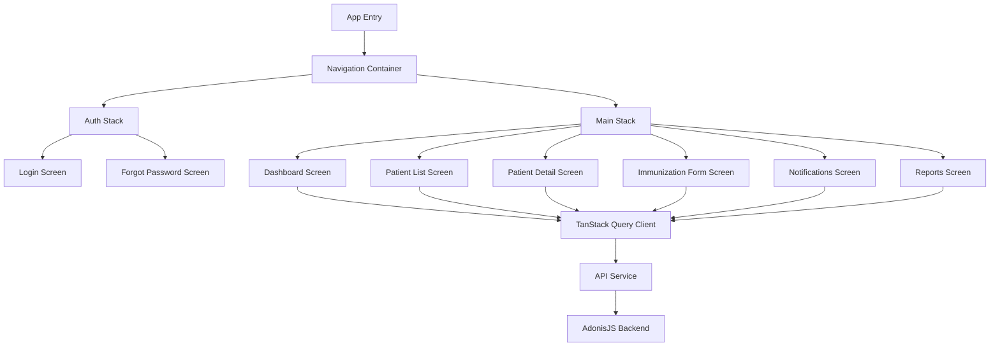
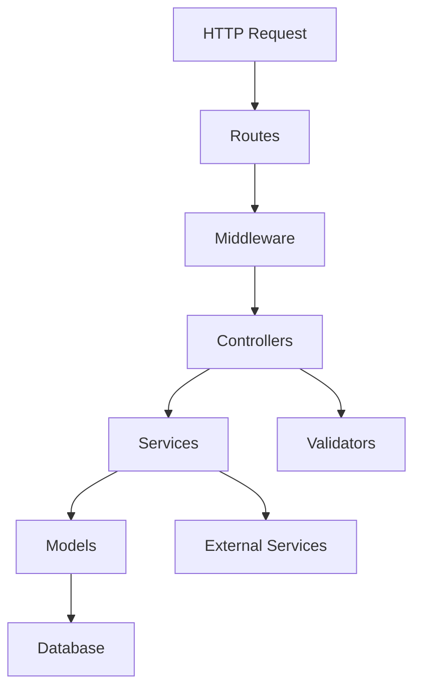
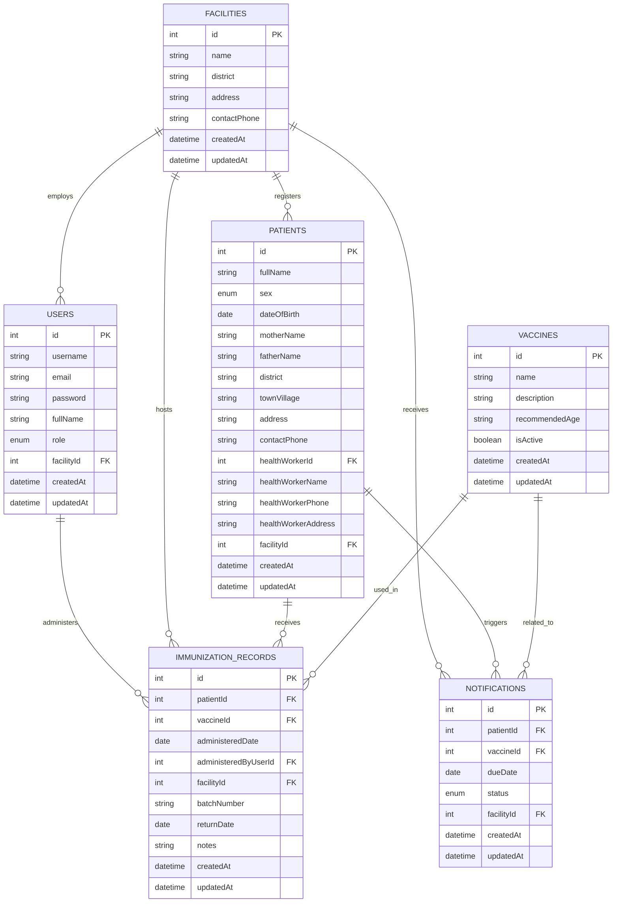
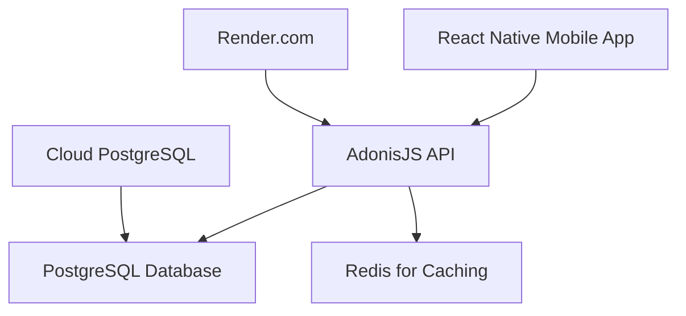

# Immunization Records Management System - Product Requirements Document

## 1. Introduction

### 1.1 Purpose
This document outlines the requirements for developing a mobile application for hospital staff to manage patient immunization records. The system will enable healthcare providers to create, update, and track immunization records, as well as receive notifications for patients due for immunizations.

### 1.2 Scope
The Immunization Records Management System will be a mobile application used exclusively by hospital staff with different roles and permission levels. The application will be built using React Native for the frontend and AdonisJS v6 for the backend API.

### 1.3 Objectives
- Digitize and centralize immunization record management
- Provide real-time access to patient immunization histories
- Streamline the immunization tracking process
- Improve immunization compliance through timely notifications
- Generate insights through reporting and analytics

## 2. User Roles and Permissions

The system will support multiple user roles with different permission levels:

| Role | Description | Permissions |
|------|-------------|-------------|
| Nurse | Primary healthcare providers who administer vaccines | - View patient records<br>- Create immunization records<br>- Update immunization records<br>- View notifications |
| Doctor | Physicians who oversee patient care | - All nurse permissions<br>- View analytics reports<br>- Export patient data |
| Administrator | Staff responsible for system management | - All doctor permissions<br>- Manage user accounts<br>- Configure system settings<br>- Access all reports and analytics |
| Supervisor | Oversees healthcare operations | - View all records and reports<br>- Access comprehensive analytics<br>- Monitor staff activities<br>- Cannot modify records directly |

## 3. Data Models

Based on the provided Excel template, the following data models will be implemented:

### 3.1 User Model

```typescript
interface User {
  id: number;
  username: string;
  email: string;
  password: string; // Hashed
  fullName: string;
  role: 'nurse' | 'doctor' | 'administrator' | 'supervisor';
  facilityId: number;
  createdAt: DateTime;
  updatedAt: DateTime;
}
```

### 3.2 Patient Model

```typescript
interface Patient {
  id: number;
  fullName: string;
  sex: 'M' | 'F';
  dateOfBirth: Date;
  motherName: string;
  fatherName: string;
  district: string;
  townVillage: string;
  address: string;
  contactPhone: string;
  healthWorkerId: number | null; // Reference to community health worker
  healthWorkerName: string | null;
  healthWorkerPhone: string | null;
  healthWorkerAddress: string | null;
  facilityId: number;
  createdAt: DateTime;
  updatedAt: DateTime;
}
```

### 3.3 Facility Model

```typescript
interface Facility {
  id: number;
  name: string;
  district: string;
  address: string;
  contactPhone: string;
  createdAt: DateTime;
  updatedAt: DateTime;
}
```

### 3.4 Vaccine Model

```typescript
interface Vaccine {
  id: number;
  name: string; // e.g., BCG, OPV0, Penta1, etc.
  description: string;
  recommendedAge: string; // e.g., "At birth", "6 weeks"
  isActive: boolean;
  createdAt: DateTime;
  updatedAt: DateTime;
}
```

### 3.5 Immunization Record Model

```typescript
interface ImmunizationRecord {
  id: number;
  patientId: number;
  vaccineId: number;
  administeredDate: Date;
  administeredByUserId: number;
  facilityId: number;
  batchNumber: string | null;
  returnDate: Date | null;
  notes: string | null;
  createdAt: DateTime;
  updatedAt: DateTime;
}
```

### 3.6 Notification Model

```typescript
interface Notification {
  id: number;
  patientId: number;
  vaccineId: number;
  dueDate: Date;
  status: 'pending' | 'viewed' | 'completed' | 'overdue';
  facilityId: number;
  createdAt: DateTime;
  updatedAt: DateTime;
}
```

## 4. API Endpoints

The following API endpoints will be implemented using AdonisJS v6:

### 4.1 Authentication

```
POST /api/auth/login
POST /api/auth/logout
POST /api/auth/refresh-token
```

### 4.2 Users

```
GET /api/users
GET /api/users/:id
POST /api/users
PUT /api/users/:id
DELETE /api/users/:id
```

### 4.3 Patients

```
GET /api/patients
GET /api/patients/:id
POST /api/patients
PUT /api/patients/:id
DELETE /api/patients/:id
GET /api/patients/search?query=
```

### 4.4 Facilities

```
GET /api/facilities
GET /api/facilities/:id
POST /api/facilities
PUT /api/facilities/:id
DELETE /api/facilities/:id
```

### 4.5 Vaccines

```
GET /api/vaccines
GET /api/vaccines/:id
POST /api/vaccines
PUT /api/vaccines/:id
DELETE /api/vaccines/:id
```

### 4.6 Immunization Records

```
GET /api/immunization-records
GET /api/immunization-records/:id
POST /api/immunization-records
PUT /api/immunization-records/:id
DELETE /api/immunization-records/:id
GET /api/patients/:id/immunization-records
```

### 4.7 Notifications

```
GET /api/notifications
GET /api/notifications/:id
PUT /api/notifications/:id
GET /api/notifications/due
```

### 4.8 Reports and Analytics

```
GET /api/reports/immunization-coverage
GET /api/reports/due-immunizations
GET /api/reports/facility-performance
```

## 5. Feature Specifications

### 5.1 Authentication

The system will implement JWT-based authentication with the following features:

- Secure login with username/email and password
- Token-based authentication with refresh tokens
- Role-based access control
- Session timeout after period of inactivity
- Password hashing using bcrypt

**Example Authentication Flow:**

```typescript
// AdonisJS Controller Example
import { HttpContextContract } from '@adonisjs/core/http'
import User from 'App/Models/User'
import Hash from '@adonisjs/core/hash'

export default class AuthController {
  public async login({ request, response, auth }: HttpContextContract) {
    const { email, password } = request.only(['email', 'password'])
    
    // Find user
    const user = await User.findBy('email', email)
    if (!user) {
      return response.unauthorized('Invalid credentials')
    }
    
    // Verify password
    if (!(await Hash.verify(user.password, password))) {
      return response.unauthorized('Invalid credentials')
    }
    
    // Generate token
    const token = await auth.use('api').generate(user, {
      expiresIn: '1 day'
    })
    
    return response.json({
      user: {
        id: user.id,
        email: user.email,
        fullName: user.fullName,
        role: user.role
      },
      token
    })
  }
}
```

### 5.2 Immunization Record Management

The system will provide comprehensive CRUD operations for immunization records:

- Create new immunization records
- View individual and list of immunization records
- Update existing immunization records
- Delete immunization records (with appropriate permissions)
- Filter and search immunization records

**Example Immunization Record Creation:**

```typescript
// AdonisJS Controller Example
import { HttpContextContract } from '@adonisjs/core/http'
import ImmunizationRecord from 'App/Models/ImmunizationRecord'

export default class ImmunizationRecordsController {
  public async store({ request, response, auth }: HttpContextContract) {
    const user = auth.user!
    
    const data = request.only([
      'patientId',
      'vaccineId',
      'administeredDate',
      'batchNumber',
      'returnDate',
      'notes'
    ])
    
    const immunizationRecord = await ImmunizationRecord.create({
      ...data,
      administeredByUserId: user.id,
      facilityId: user.facilityId
    })
    
    return response.created(immunizationRecord)
  }
}
```

### 5.3 Notification System

The system will provide in-app notifications for patients due for immunizations:

- Automatic generation of notifications based on vaccine schedules
- Dashboard display of pending immunizations
- Ability to mark notifications as viewed or completed
- Sorting of notifications by due date

**Example Notification Generation:**

```typescript
// AdonisJS Service Example
import ImmunizationRecord from 'App/Models/ImmunizationRecord'
import Notification from 'App/Models/Notification'
import { DateTime } from 'luxon'

export default class NotificationService {
  public async generateDueNotifications() {
    // Find immunization records with return dates
    const records = await ImmunizationRecord.query()
      .whereNotNull('returnDate')
      .where('returnDate', '>=', DateTime.now().toSQL())
      .where('returnDate', '<=', DateTime.now().plus({ days: 7 }).toSQL())
    
    // Create notifications for each record
    for (const record of records) {
      await Notification.firstOrCreate(
        {
          patientId: record.patientId,
          vaccineId: record.vaccineId,
          dueDate: record.returnDate
        },
        {
          patientId: record.patientId,
          vaccineId: record.vaccineId,
          dueDate: record.returnDate,
          status: 'pending',
          facilityId: record.facilityId
        }
      )
    }
  }
}
```

### 5.4 Reporting and Analytics

The system will provide a reporting and analytics dashboard with the following features:

- Immunization coverage rates by vaccine type
- Due and overdue immunizations
- Facility performance metrics
- Trend analysis over time
- Exportable reports in various formats (PDF, CSV)

**Example Analytics Query:**

```typescript
// AdonisJS Controller Example
import { HttpContextContract } from '@adonisjs/core/http'
import Database from '@adonisjs/lucid/database'

export default class ReportsController {
  public async immunizationCoverage({ request, response }: HttpContextContract) {
    const { startDate, endDate, facilityId } = request.qs()
    
    const query = Database.from('immunization_records')
      .join('vaccines', 'immunization_records.vaccine_id', 'vaccines.id')
      .select('vaccines.name')
      .count('immunization_records.id as count')
      .groupBy('vaccines.name')
      .orderBy('count', 'desc')
    
    if (startDate && endDate) {
      query.whereBetween('administered_date', [startDate, endDate])
    }
    
    if (facilityId) {
      query.where('facility_id', facilityId)
    }
    
    const results = await query
    
    return response.json(results)
  }
}
```

### 5.5 Patient Search and Filtering

The system will provide robust search and filtering capabilities:

- Search patients by name, ID, or contact information
- Filter patients by age, sex, location, or vaccination status
- Sort results by various criteria
- Save frequent searches

**Example Search Implementation:**

```typescript
// AdonisJS Controller Example
import { HttpContextContract } from '@adonisjs/core/http'
import Patient from 'App/Models/Patient'

export default class PatientsController {
  public async search({ request, response }: HttpContextContract) {
    const { query, district, ageRange, sex, vaccinationStatus } = request.qs()
    
    const patientsQuery = Patient.query()
    
    if (query) {
      patientsQuery.where(q => {
        q.where('fullName', 'ILIKE', `%${query}%`)
          .orWhere('motherName', 'ILIKE', `%${query}%`)
          .orWhere('fatherName', 'ILIKE', `%${query}%`)
          .orWhere('contactPhone', 'ILIKE', `%${query}%`)
      })
    }
    
    if (district) {
      patientsQuery.where('district', district)
    }
    
    if (sex) {
      patientsQuery.where('sex', sex)
    }
    
    // Additional filters can be applied here
    
    const patients = await patientsQuery.paginate(
      request.input('page', 1),
      request.input('limit', 20)
    )
    
    return response.json(patients)
  }
}
```

## 6. Security Considerations

The application will implement the following security measures:

- Authentication using JWT tokens
- Password hashing using bcrypt
- HTTPS for all API communications
- Input validation and sanitization
- Protection against common web vulnerabilities (XSS, CSRF, SQL Injection)
- Data encryption at rest and in transit
- Audit logging for sensitive operations
- Session timeout after period of inactivity

## 7. Technical Architecture

### 7.1 Frontend Architecture (React Native)



### 7.2 Backend Architecture (AdonisJS v6)



### 7.3 Database Schema



## 8. Example Code Snippets

### 8.1 React Native Component for Immunization Form

```tsx
import React, { useState } from 'react';
import { View, Text, TextInput, Button, StyleSheet, ScrollView } from 'react-native';
import { Picker } from '@react-native-picker/picker';
import DateTimePicker from '@react-native-community/datetimepicker';
import { useQuery, useMutation, useQueryClient } from '@tanstack/react-query';
import { fetchVaccines, createImmunizationRecord } from '../api/immunizationApi';

const ImmunizationForm = ({ route, navigation }) => {
  const { patientId } = route.params;
  const queryClient = useQueryClient();
  
  // Fetch vaccines using TanStack Query
  const { data: vaccines = [] } = useQuery({
    queryKey: ['vaccines'],
    queryFn: fetchVaccines
  });
  
  // Create mutation for adding a new immunization record
  const createRecordMutation = useMutation({
    mutationFn: createImmunizationRecord,
    onSuccess: () => {
      // Invalidate and refetch immunization records for this patient
      queryClient.invalidateQueries(['immunizationRecords', patientId]);
      navigation.goBack();
    }
  });
  
  const [formData, setFormData] = useState({
    patientId,
    vaccineId: '',
    administeredDate: new Date(),
    batchNumber: '',
    returnDate: new Date(Date.now() + 30 * 24 * 60 * 60 * 1000), // Default to 30 days later
    notes: ''
  });
  
  const handleSubmit = () => {
    createRecordMutation.mutate(formData);
  };
  
  return (
    <ScrollView style={styles.container}>
      <Text style={styles.title}>New Immunization Record</Text>
      
      <Text style={styles.label}>Vaccine</Text>
      <Picker
        selectedValue={formData.vaccineId}
        onValueChange={(value) => setFormData({...formData, vaccineId: value})}
      >
        <Picker.Item label="Select a vaccine" value="" />
        {vaccines.map(vaccine => (
          <Picker.Item key={vaccine.id} label={vaccine.name} value={vaccine.id} />
        ))}
      </Picker>
      
      <Text style={styles.label}>Administration Date</Text>
      <DateTimePicker
        value={formData.administeredDate}
        mode="date"
        display="default"
        onChange={(event, date) => setFormData({...formData, administeredDate: date})}
      />
      
      <Text style={styles.label}>Batch Number</Text>
      <TextInput
        style={styles.input}
        value={formData.batchNumber}
        onChangeText={(text) => setFormData({...formData, batchNumber: text})}
        placeholder="Enter batch number"
      />
      
      <Text style={styles.label}>Return Date</Text>
      <DateTimePicker
        value={formData.returnDate}
        mode="date"
        display="default"
        onChange={(event, date) => setFormData({...formData, returnDate: date})}
      />
      
      <Text style={styles.label}>Notes</Text>
      <TextInput
        style={[styles.input, styles.textArea]}
        value={formData.notes}
        onChangeText={(text) => setFormData({...formData, notes: text})}
        placeholder="Enter any notes"
        multiline
        numberOfLines={4}
      />
      
      {createRecordMutation.isLoading ? (
        <Text>Saving...</Text>
      ) : (
        <Button
          title="Save Record"
          onPress={handleSubmit}
          disabled={createRecordMutation.isLoading}
        />
      )}
    </ScrollView>
  );
};

const styles = StyleSheet.create({
  container: {
    flex: 1,
    padding: 16,
  },
  title: {
    fontSize: 24,
    fontWeight: 'bold',
    marginBottom: 16,
  },
  label: {
    fontSize: 16,
    marginTop: 8,
    marginBottom: 4,
  },
  input: {
    borderWidth: 1,
    borderColor: '#ccc',
    borderRadius: 4,
    padding: 8,
    marginBottom: 16,
  },
  textArea: {
    height: 100,
  },
});

export default ImmunizationForm;
```

### 8.2 AdonisJS Migration for Patients Table

```typescript
import { BaseSchema } from '@adonisjs/lucid/schema'

export default class extends BaseSchema {
  protected tableName = 'patients'

  async up() {
    this.schema.createTable(this.tableName, (table) => {
      table.increments('id').primary()
      table.string('full_name').notNullable()
      table.enum('sex', ['M', 'F']).notNullable()
      table.date('date_of_birth').notNullable()
      table.string('mother_name')
      table.string('father_name')
      table.string('district').notNullable()
      table.string('town_village')
      table.string('address')
      table.string('contact_phone')
      table.integer('health_worker_id').unsigned().references('id').inTable('users').onDelete('SET NULL')
      table.string('health_worker_name')
      table.string('health_worker_phone')
      table.string('health_worker_address')
      table.integer('facility_id').unsigned().references('id').inTable('facilities').notNullable()
      
      table.timestamp('created_at')
      table.timestamp('updated_at')
    })
  }

  async down() {
    this.schema.dropTable(this.tableName)
  }
}
```

### 8.3 TanStack Query Setup for Immunization Records

```typescript
// api/immunizationApi.ts
import axios from 'axios';

const api = axios.create({
  baseURL: 'https://api.example.com',
  headers: {
    'Content-Type': 'application/json',
  },
});

// Set auth token for API requests
export const setAuthToken = (token) => {
  if (token) {
    api.defaults.headers.common['Authorization'] = `Bearer ${token}`;
  } else {
    delete api.defaults.headers.common['Authorization'];
  }
};

// API functions for TanStack Query
export const fetchVaccines = async () => {
  const response = await api.get('/vaccines');
  return response.data;
};

export const fetchImmunizationRecords = async (patientId) => {
  const response = await api.get(`/patients/${patientId}/immunization-records`);
  return response.data;
};

export const createImmunizationRecord = async (recordData) => {
  const response = await api.post('/immunization-records', recordData);
  return response.data;
};

export const updateImmunizationRecord = async ({ id, ...data }) => {
  const response = await api.put(`/immunization-records/${id}`, data);
  return response.data;
};

export const deleteImmunizationRecord = async (id) => {
  await api.delete(`/immunization-records/${id}`);
  return id;
};

// Example of TanStack Query hooks usage in a component
// hooks/useImmunizationRecords.ts
import { useQuery, useMutation, useQueryClient } from '@tanstack/react-query';
import {
  fetchImmunizationRecords,
  createImmunizationRecord,
  updateImmunizationRecord,
  deleteImmunizationRecord
} from '../api/immunizationApi';

export const useImmunizationRecords = (patientId) => {
  const queryClient = useQueryClient();
  
  // Query for fetching immunization records
  const recordsQuery = useQuery({
    queryKey: ['immunizationRecords', patientId],
    queryFn: () => fetchImmunizationRecords(patientId),
    enabled: !!patientId, // Only run query if patientId exists
  });
  
  // Mutation for creating a new record
  const createMutation = useMutation({
    mutationFn: createImmunizationRecord,
    onSuccess: (newRecord) => {
      // Update cache with new record
      queryClient.setQueryData(['immunizationRecords', patientId], (oldData = []) => {
        return [...oldData, newRecord];
      });
    },
  });
  
  // Mutation for updating a record
  const updateMutation = useMutation({
    mutationFn: updateImmunizationRecord,
    onSuccess: (updatedRecord) => {
      // Update cache with updated record
      queryClient.setQueryData(['immunizationRecords', patientId], (oldData = []) => {
        return oldData.map(record =>
          record.id === updatedRecord.id ? updatedRecord : record
        );
      });
    },
  });
  
  // Mutation for deleting a record
  const deleteMutation = useMutation({
    mutationFn: deleteImmunizationRecord,
    onSuccess: (deletedId) => {
      // Remove deleted record from cache
      queryClient.setQueryData(['immunizationRecords', patientId], (oldData = []) => {
        return oldData.filter(record => record.id !== deletedId);
      });
    },
  });
  
  return {
    records: recordsQuery.data || [],
    isLoading: recordsQuery.isLoading,
    isError: recordsQuery.isError,
    error: recordsQuery.error,
    createRecord: createMutation.mutate,
    updateRecord: updateMutation.mutate,
    deleteRecord: deleteMutation.mutate,
    createStatus: createMutation.status,
    updateStatus: updateMutation.status,
    deleteStatus: deleteMutation.status,
  };
};
```

## 9. Deployment Architecture

The application will be deployed using the following architecture:



### 9.1 Backend Deployment (Render.com)

- AdonisJS API will be deployed on Render.com
- Environment variables will be configured in Render.com dashboard
- Automatic deployments from Git repository

### 9.2 Database Deployment

- PostgreSQL database will be hosted in the cloud
- Database migrations will be run during deployment
- Regular backups will be configured

### 9.3 Mobile App Distribution

- React Native app will be built for Android and iOS
- App will be distributed to hospital staff through appropriate channels
- Updates will be pushed through app stores or enterprise distribution methods

## 10. Future Considerations

While not part of the initial scope, the following features could be considered for future iterations:

1. **Offline Mode**: Allow the app to function without internet connectivity and sync when connection is restored
2. **Integration with National Health Systems**: Connect with national immunization databases
3. **Barcode/QR Code Scanning**: For quick patient identification and vaccine tracking
4. **Multilingual Support**: Add support for multiple languages
5. **Advanced Analytics**: Predictive analytics for immunization planning
6. **Patient Portal**: A companion app for patients to view their own records

## 11. Conclusion

This PRD outlines the requirements for developing the Immunization Records Management System. The system will provide hospital staff with a comprehensive tool for managing patient immunization records, improving efficiency, and ensuring timely immunizations through notifications.

The implementation will follow modern development practices, with a React Native frontend and AdonisJS v6 backend, deployed on Render.com with a cloud PostgreSQL database.