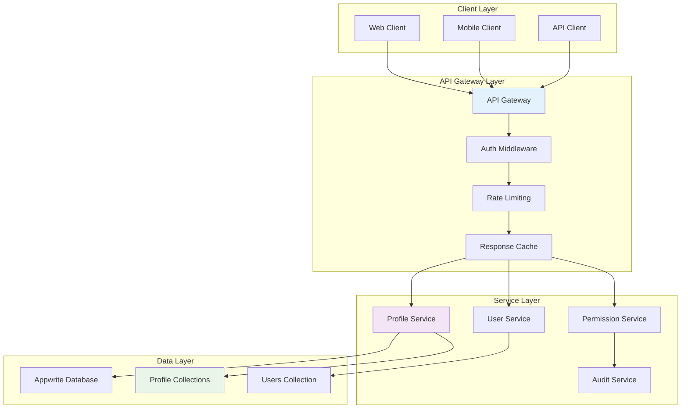

# Profile API Patterns and Design

## Overview

This document outlines comprehensive API patterns for Profile operations, including RESTful endpoints, GraphQL schemas, real-time subscriptions, and integration patterns that work seamlessly with the existing Appwrite infrastructure.

## API Architecture

### Multi-Layer API Design



## RESTful API Endpoints

### 1. Profile Management Endpoints

#### Patient Profile Operations

```javascript
// GET /api/v1/profiles/patient/{userId}
// Get patient profile information
app.get('/api/v1/profiles/patient/:userId', [
  authenticateUser,
  requireProfileType(['admin', 'employee', 'patient']),
  validatePatientAccess
], async (req, res) => {
  try {
    const { userId } = req.params;
    const requestingUser = req.userProfile;
    
    // Check access permissions
    if (requestingUser.type === 'patient' && requestingUser.userId !== userId) {
      return res.status(403).json({ error: 'Access denied' });
    }
    
    const profileService = new ProfileService();
    const patientProfile = await profileService.getPatientProfile(userId);
    
    if (!patientProfile) {
      return res.status(404).json({ error: 'Patient profile not found' });
    }
    
    // Apply field-level security
    const securityService = new FieldLevelSecurity();
    const allowedFields = securityService.getFieldPermissions(
      requestingUser.type, 
      'patient_profiles', 
      'read'
    );
    
    const filteredProfile = securityService.filterFields(patientProfile, allowedFields);
    
    // Log access
    await auditService.logProfileAccess(
      req.user.$id, 
      requestingUser.type, 
      'patient_profiles', 
      'read',
      { allowed: true }
    );
    
    res.json({
      success: true,
      data: filteredProfile,
      meta: {
        accessLevel: requestingUser.type,
        fieldsReturned: Object.keys(filteredProfile).length
      }
    });
    
  } catch (error) {
    res.status(500).json({ error: error.message });
  }
});

// POST /api/v1/profiles/patient
// Create new patient profile
app.post('/api/v1/profiles/patient', [
  authenticateUser,
  requireProfileType(['admin', 'employee']),
  validateCreatePatientProfile
], async (req, res) => {
  try {
    const profileData = req.body;
    const requestingUser = req.userProfile;
    
    // Validate patient exists
    const patient = await databases.getDocument('main', 'patients', profileData.patient_id);
    if (!patient) {
      return res.status(400).json({ error: 'Patient record not found' });
    }
    
    // Check facility access for employees
    if (requestingUser.type === 'employee') {
      const hasAccess = await validateFacilityAccess(
        requestingUser, 
        patient.facility_id
      );
      if (!hasAccess) {
        return res.status(403).json({ error: 'Facility access denied' });
      }
    }
    
    // Create user account first
    const userAccount = await users.create(
      ID.unique(),
      profileData.email,
      profileData.phone,
      profileData.password,
      patient.full_name
    );
    
    // Add patient role labels
    await users.updateLabels(userAccount.$id, [
      'role:patient',
      `facility_${patient.facility_id}`
    ]);
    
    // Create patient profile
    const profile = await databases.createDocument('main', 'patient_profiles', ID.unique(), {
      user_id: userAccount.$id,
      patient_id: profileData.patient_id,
      facility_id: patient.facility_id,
      verification_status: 'pending',
      verification_method: profileData.verification_method || 'email',
      access_permissions: ['view_own_records', 'receive_notifications'],
      notification_preferences: JSON.stringify(profileData.notification_preferences || {}),
      created_at: new Date().toISOString(),
      updated_at: new Date().toISOString()
    });
    
    // Log creation
    await auditService.logProfileModification(
      req.user.$id,
      'patient',
      profile.$id,
      { action: 'created', patient_id: profileData.patient_id }
    );
    
    res.status(201).json({
      success: true,
      data: {
        profile,
        user: {
          id: userAccount.$id,
          email: userAccount.email,
          name: userAccount.name
        }
      }
    });
    
  } catch (error) {
    res.status(500).json({ error: error.message });
  }
});

// PUT /api/v1/profiles/patient/{userId}
// Update patient profile
app.put('/api/v1/profiles/patient/:userId', [
  authenticateUser,
  requireProfileType(['admin', 'employee', 'patient']),
  validateUpdatePatientProfile
], async (req, res) => {
  try {
    const { userId } = req.params;
    const updateData = req.body;
    const requestingUser = req.userProfile;
    
    // Get existing profile
    const existingProfile = await databases.listDocuments('main', 'patient_profiles', [
      Query.equal('user_id', userId)
    ]);
    
    if (existingProfile.documents.length === 0) {
      return res.status(404).json({ error: 'Patient profile not found' });
    }
    
    const profile = existingProfile.documents[0];
    
    // Check update permissions
    if (requestingUser.type === 'patient' && requestingUser.userId !== userId) {
      return res.status(403).json({ error: 'Access denied' });
    }
    
    // Apply field-level security for updates
    const securityService = new FieldLevelSecurity();
    const allowedFields = securityService.getFieldPermissions(
      requestingUser.type,
      'patient_profiles',
      'update'
    );
    
    const filteredUpdateData = securityService.filterFields(updateData, allowedFields);
    
    // Update profile
    const updatedProfile = await databases.updateDocument(
      'main',
      'patient_profiles',
      profile.$id,
      {
        ...filteredUpdateData,
        updated_at: new Date().toISOString()
      }
    );
    
    // Log modification
    await auditService.logProfileModification(
      req.user.$id,
      'patient',
      profile.$id,
      { action: 'updated', fields: Object.keys(filteredUpdateData) }
    );
    
    res.json({
      success: true,
      data: updatedProfile
    });
    
  } catch (error) {
    res.status(500).json({ error: error.message });
  }
});
```

#### Employee Profile Operations

```javascript
// GET /api/v1/profiles/employee/{userId}
// Get employee profile information
app.get('/api/v1/profiles/employee/:userId', [
  authenticateUser,
  requireProfileType(['admin', 'employee']),
  validateEmployeeAccess
], async (req, res) => {
  try {
    const { userId } = req.params;
    const requestingUser = req.userProfile;
    
    const profileService = new ProfileService();
    const employeeProfile = await profileService.getEmployeeProfile(userId);
    
    if (!employeeProfile) {
      return res.status(404).json({ error: 'Employee profile not found' });
    }
    
    // Check hierarchy access for non-admin users
    if (requestingUser.type === 'employee') {
      const hasAccess = await validateHierarchyAccess(requestingUser, employeeProfile);
      if (!hasAccess) {
        return res.status(403).json({ error: 'Hierarchy access denied' });
      }
    }
    
    // Apply field-level security
    const securityService = new FieldLevelSecurity();
    const allowedFields = securityService.getFieldPermissions(
      requestingUser.type,
      'employee_profiles',
      'read'
    );
    
    const filteredProfile = securityService.filterFields(employeeProfile, allowedFields);
    
    // Include enhanced information for admins
    if (requestingUser.type === 'admin') {
      filteredProfile.performance_summary = await getPerformanceSummary(userId);
      filteredProfile.license_status = await getLicenseStatus(employeeProfile);
    }
    
    res.json({
      success: true,
      data: filteredProfile
    });
    
  } catch (error) {
    res.status(500).json({ error: error.message });
  }
});

// POST /api/v1/profiles/employee
// Create new employee profile (onboarding)
app.post('/api/v1/profiles/employee', [
  authenticateUser,
  requireProfileType(['admin']),
  validateCreateEmployeeProfile
], async (req, res) => {
  try {
    const employeeData = req.body;
    
    // Create user account
    const userAccount = await users.create(
      ID.unique(),
      employeeData.email,
      employeeData.phone,
      employeeData.password,
      employeeData.name
    );
    
    // Add role labels
    const roleLabel = `role:${employeeData.employee_type}`;
    const facilityLabel = `facility_${employeeData.primary_facility_id}`;
    await users.updateLabels(userAccount.$id, [roleLabel, facilityLabel]);
    
    // Add to facility team
    const teamId = `facility-${employeeData.primary_facility_id}-team`;
    const teamRole = getTeamRoleFromEmployeeType(employeeData.employee_type);
    await teams.createMembership(teamId, userAccount.$id, [], teamRole);
    
    // Create employee profile
    const profile = await databases.createDocument('main', 'employee_profiles', ID.unique(), {
      user_id: userAccount.$id,
      employee_id: employeeData.employee_id,
      employee_type: employeeData.employee_type,
      professional_title: employeeData.professional_title,
      license_number: employeeData.license_number,
      license_expiry_date: employeeData.license_expiry_date,
      specializations: employeeData.specializations || [],
      primary_facility_id: employeeData.primary_facility_id,
      assigned_facilities: employeeData.assigned_facilities || [employeeData.primary_facility_id],
      department: employeeData.department,
      employment_status: 'active',
      hire_date: new Date().toISOString(),
      contact_information: JSON.stringify({
        email: employeeData.email,
        phone: employeeData.phone,
        address: employeeData.address
      }),
      created_at: new Date().toISOString(),
      updated_at: new Date().toISOString()
    });
    
    // Log creation
    await auditService.logProfileModification(
      req.user.$id,
      'employee',
      profile.$id,
      { action: 'created', employee_type: employeeData.employee_type }
    );
    
    res.status(201).json({
      success: true,
      data: {
        profile,
        user: {
          id: userAccount.$id,
          email: userAccount.email,
          name: userAccount.name
        }
      }
    });
    
  } catch (error) {
    res.status(500).json({ error: error.message });
  }
});
```

#### Admin Profile Operations

```javascript
// GET /api/v1/profiles/admin/{userId}
// Get admin profile information
app.get('/api/v1/profiles/admin/:userId', [
  authenticateUser,
  requireProfileType(['admin']),
  validateAdminAccess
], async (req, res) => {
  try {
    const { userId } = req.params;
    const requestingUser = req.userProfile;
    
    // Only allow self-access or super admin access
    if (requestingUser.userId !== userId && requestingUser.profile.admin_level !== 'super_admin') {
      return res.status(403).json({ error: 'Access denied' });
    }
    
    const profileService = new ProfileService();
    const adminProfile = await profileService.getAdminProfile(userId);
    
    if (!adminProfile) {
      return res.status(404).json({ error: 'Admin profile not found' });
    }
    
    // Include security information
    adminProfile.security_status = await getSecurityStatus(adminProfile);
    adminProfile.recent_activities = await getRecentAdminActivities(userId);
    
    res.json({
      success: true,
      data: adminProfile
    });
    
  } catch (error) {
    res.status(500).json({ error: error.message });
  }
});
```

### 2. Profile Discovery and Search Endpoints

```javascript
// GET /api/v1/profiles/search
// Search profiles across types
app.get('/api/v1/profiles/search', [
  authenticateUser,
  requireProfileType(['admin', 'employee']),
  validateSearchPermissions
], async (req, res) => {
  try {
    const { query, type, facility_id, limit = 20, offset = 0 } = req.query;
    const requestingUser = req.userProfile;
    
    const searchService = new ProfileSearchService();
    const results = await searchService.searchProfiles({
      query,
      type,
      facility_id,
      limit: parseInt(limit),
      offset: parseInt(offset),
      requestingUser
    });
    
    res.json({
      success: true,
      data: results.profiles,
      meta: {
        total: results.total,
        limit: parseInt(limit),
        offset: parseInt(offset),
        hasMore: results.total > (parseInt(offset) + parseInt(limit))
      }
    });
    
  } catch (error) {
    res.status(500).json({ error: error.message });
  }
});

// GET /api/v1/profiles/facility/{facilityId}
// Get all profiles for a facility
app.get('/api/v1/profiles/facility/:facilityId', [
  authenticateUser,
  requireProfileType(['admin', 'employee']),
  requireFacilityAccess
], async (req, res) => {
  try {
    const { facilityId } = req.params;
    const { type, status, limit = 50, offset = 0 } = req.query;
    
    const facilityService = new FacilityProfileService();
    const profiles = await facilityService.getFacilityProfiles({
      facilityId,
      type,
      status,
      limit: parseInt(limit),
      offset: parseInt(offset)
    });
    
    res.json({
      success: true,
      data: profiles
    });
    
  } catch (error) {
    res.status(500).json({ error: error.message });
  }
});
```

### 3. Profile Analytics and Reporting Endpoints

```javascript
// GET /api/v1/profiles/analytics/overview
// Get profile analytics overview
app.get('/api/v1/profiles/analytics/overview', [
  authenticateUser,
  requireProfileType(['admin']),
  validateAnalyticsAccess
], async (req, res) => {
  try {
    const { facility_id, date_range } = req.query;
    
    const analyticsService = new ProfileAnalyticsService();
    const overview = await analyticsService.getProfileOverview({
      facilityId: facility_id,
      dateRange: date_range
    });
    
    res.json({
      success: true,
      data: overview
    });
    
  } catch (error) {
    res.status(500).json({ error: error.message });
  }
});

// GET /api/v1/profiles/analytics/performance
// Get employee performance analytics
app.get('/api/v1/profiles/analytics/performance', [
  authenticateUser,
  requireProfileType(['admin', 'employee']),
  validatePerformanceAccess
], async (req, res) => {
  try {
    const { facility_id, employee_type, date_range } = req.query;
    const requestingUser = req.userProfile;
    
    // Restrict access based on user type
    let facilityFilter = facility_id;
    if (requestingUser.type === 'employee') {
      facilityFilter = requestingUser.profile.primary_facility_id;
    }
    
    const performanceService = new PerformanceAnalyticsService();
    const performance = await performanceService.getPerformanceMetrics({
      facilityId: facilityFilter,
      employeeType: employee_type,
      dateRange: date_range
    });
    
    res.json({
      success: true,
      data: performance
    });
    
  } catch (error) {
    res.status(500).json({ error: error.message });
  }
});
```

## GraphQL Schema and Resolvers

### 1. GraphQL Type Definitions

```graphql
# Profile Types
type PatientProfile {
  id: ID!
  userId: ID!
  patientId: ID!
  profileStatus: ProfileStatus!
  verificationStatus: VerificationStatus!
  verificationMethod: String
  guardianUserId: ID
  accessPermissions: [String!]!
  notificationPreferences: JSON
  emergencyContact: JSON
  facilityId: ID!
  facility: Facility
  patient: Patient
  createdAt: DateTime!
  updatedAt: DateTime!
}

type EmployeeProfile {
  id: ID!
  userId: ID!
  employeeId: String!
  employeeType: EmployeeType!
  professionalTitle: String
  licenseNumber: String
  licenseExpiryDate: DateTime
  specializations: [String!]
  primaryFacilityId: ID!
  assignedFacilities: [ID!]
  department: String
  supervisorUserId: ID
  employmentStatus: EmploymentStatus!
  hireDate: DateTime
  workSchedule: JSON
  contactInformation: JSON
  emergencyContact: JSON
  trainingRecords: JSON
  performanceMetrics: JSON
  primaryFacility: Facility
  assignedFacilitiesList: [Facility!]
  supervisor: EmployeeProfile
  subordinates: [EmployeeProfile!]
  createdAt: DateTime!
  updatedAt: DateTime!
}

type AdminProfile {
  id: ID!
  userId: ID!
  adminLevel: AdminLevel!
  systemPermissions: [String!]!
  facilityAccessScope: FacilityAccessScope!
  assignedFacilities: [ID!]
  securityClearance: SecurityClearance!
  mfaEnabled: Boolean!
  lastSecurityReview: DateTime
  auditLogAccess: Boolean!
  systemConfigAccess: Boolean!
  userManagementScope: UserManagementScope!
  backupAdminUserId: ID
  adminNotes: String
  assignedFacilitiesList: [Facility!]
  backupAdmin: AdminProfile
  createdAt: DateTime!
  updatedAt: DateTime!
}

# Enums
enum ProfileStatus {
  ACTIVE
  INACTIVE
  SUSPENDED
}

enum VerificationStatus {
  PENDING
  VERIFIED
  REJECTED
}

enum EmployeeType {
  DOCTOR
  SUPERVISOR
  NURSE
  DATA_ENTRY_CLERK
  TECHNICIAN
}

enum EmploymentStatus {
  ACTIVE
  INACTIVE
  SUSPENDED
  TERMINATED
}

enum AdminLevel {
  SUPER_ADMIN
  SYSTEM_ADMIN
  FACILITY_ADMIN
}

enum FacilityAccessScope {
  ALL
  ASSIGNED
  SINGLE
}

enum SecurityClearance {
  HIGH
  MEDIUM
  STANDARD
}

enum UserManagementScope {
  GLOBAL
  FACILITY
  DEPARTMENT
}

# Input Types
input CreatePatientProfileInput {
  patientId: ID!
  email: String!
  phone: String
  password: String!
  verificationMethod: String
  notificationPreferences: JSON
  emergencyContact: JSON
}

input UpdatePatientProfileInput {
  verificationStatus: VerificationStatus
  accessPermissions: [String!]
  notificationPreferences: JSON
  emergencyContact: JSON
}

input CreateEmployeeProfileInput {
  employeeId: String!
  employeeType: EmployeeType!
  professionalTitle: String
  licenseNumber: String
  licenseExpiryDate: DateTime
  specializations: [String!]
  primaryFacilityId: ID!
  assignedFacilities: [ID!]
  department: String
  email: String!
  phone: String
  password: String!
  name: String!
  address: String
}

input UpdateEmployeeProfileInput {
  professionalTitle: String
  licenseNumber: String
  licenseExpiryDate: DateTime
  specializations: [String!]
  assignedFacilities: [ID!]
  department: String
  supervisorUserId: ID
  employmentStatus: EmploymentStatus
  workSchedule: JSON
  contactInformation: JSON
  emergencyContact: JSON
}

# Query Types
type Query {
  # Profile Queries
  patientProfile(userId: ID!): PatientProfile
  employeeProfile(userId: ID!): EmployeeProfile
  adminProfile(userId: ID!): AdminProfile
  
  # Search Queries
  searchProfiles(
    query: String
    type: String
    facilityId: ID
    limit: Int = 20
    offset: Int = 0
  ): ProfileSearchResult!
  
  facilityProfiles(
    facilityId: ID!
    type: String
    status: String
    limit: Int = 50
    offset: Int = 0
  ): FacilityProfilesResult!
  
  # Analytics Queries
  profileAnalytics(
    facilityId: ID
    dateRange: String
  ): ProfileAnalytics!
  
  performanceMetrics(
    facilityId: ID
    employeeType: EmployeeType
    dateRange: String
  ): PerformanceMetrics!
}

type Mutation {
  # Patient Profile Mutations
  createPatientProfile(input: CreatePatientProfileInput!): PatientProfileResult!
  updatePatientProfile(userId: ID!, input: UpdatePatientProfileInput!): PatientProfileResult!
  verifyPatientProfile(userId: ID!, verificationData: JSON!): PatientProfileResult!
  
  # Employee Profile Mutations
  createEmployeeProfile(input: CreateEmployeeProfileInput!): EmployeeProfileResult!
  updateEmployeeProfile(userId: ID!, input: UpdateEmployeeProfileInput!): EmployeeProfileResult!
  deactivateEmployeeProfile(userId: ID!, reason: String!): EmployeeProfileResult!
  
  # Admin Profile Mutations
  createAdminProfile(input: CreateAdminProfileInput!): AdminProfileResult!
  updateAdminProfile(userId: ID!, input: UpdateAdminProfileInput!): AdminProfileResult!
  updateSecurityClearance(userId: ID!, clearance: SecurityClearance!): AdminProfileResult!
}

type Subscription {
  # Profile Updates
  profileUpdated(userId: ID!): ProfileUpdateEvent!
  facilityProfilesUpdated(facilityId: ID!): FacilityProfileUpdateEvent!
  
  # Security Events
  securityAlert(userId: ID): SecurityAlertEvent!
  licenseExpiryAlert(facilityId: ID): LicenseExpiryEvent!
}
```

### 2. GraphQL Resolvers

```javascript
// GraphQL Resolvers
const profileResolvers = {
  Query: {
    patientProfile: async (parent, { userId }, context) => {
      await validateAccess(context.user, 'patient_profiles', 'read', { userId });
      
      const profileService = new ProfileService();
      return await profileService.getPatientProfile(userId);
    },
    
    employeeProfile: async (parent, { userId }, context) => {
      await validateAccess(context.user, 'employee_profiles', 'read', { userId });
      
      const profileService = new ProfileService();
      return await profileService.getEmployeeProfile(userId);
    },
    
    searchProfiles: async (parent, args, context) => {
      await validateAccess(context.user, 'profiles', 'search');
      
      const searchService = new ProfileSearchService();
      return await searchService.searchProfiles({
        ...args,
        requestingUser: context.userProfile
      });
    }
  },
  
  Mutation: {
    createPatientProfile: async (parent, { input }, context) => {
      await validateAccess(context.user, 'patient_profiles', 'create');
      
      const profileService = new ProfileService();
      const result = await profileService.createPatientProfile(input, context.user);
      
      // Publish subscription event
      pubsub.publish('PROFILE_CREATED', {
        profileUpdated: {
          type: 'PATIENT_PROFILE_CREATED',
          userId: result.user.id,
          profile: result.profile
        }
      });
      
      return result;
    },
    
    updateEmployeeProfile: async (parent, { userId, input }, context) => {
      await validateAccess(context.user, 'employee_profiles', 'update', { userId });
      
      const profileService = new ProfileService();
      const result = await profileService.updateEmployeeProfile(userId, input, context.user);
      
      // Publish subscription event
      pubsub.publish('PROFILE_UPDATED', {
        profileUpdated: {
          type: 'EMPLOYEE_PROFILE_UPDATED',
          userId,
          profile: result.profile,
          changes: input
        }
      });
      
      return result;
    }
  },
  
  Subscription: {
    profileUpdated: {
      subscribe: withFilter(
        () => pubsub.asyncIterator(['PROFILE_UPDATED']),
        (payload, variables) => {
          return payload.profileUpdated.userId === variables.userId;
        }
      )
    },
    
    securityAlert: {
      subscribe: withFilter(
        () => pubsub.asyncIterator(['SECURITY_ALERT']),
        async (payload, variables, context) => {
          // Only send alerts to authorized users
          const hasAccess = await validateSecurityAlertAccess(
            context.user,
            payload.securityAlert
          );
          return hasAccess && (!variables.userId || payload.securityAlert.userId === variables.userId);
        }
      )
    }
  },
  
  // Field Resolvers
  PatientProfile: {
    facility: async (parent) => {
      return await databases.getDocument('main', 'facilities', parent.facilityId);
    },
    
    patient: async (parent) => {
      return await databases.getDocument('main', 'patients', parent.patientId);
    }
  },
  
  EmployeeProfile: {
    primaryFacility: async (parent) => {
      return await databases.getDocument('main', 'facilities', parent.primaryFacilityId);
    },
    
    assignedFacilitiesList: async (parent) => {
      if (!parent.assignedFacilities || parent.assignedFacilities.length === 0) {
        return [];
      }
      
      const facilities = await Promise.all(
        parent.assignedFacilities.map(id => 
          databases.getDocument('main', 'facilities', id)
        )
      );
      
      return facilities.filter(f => f !== null);
    },
    
    supervisor: async (parent) => {
      if (!parent.supervisorUserId) return null;
      
      const profileService = new ProfileService();
      return await profileService.getEmployeeProfile(parent.supervisorUserId);
    },
    
    subordinates: async (parent) => {
      const subordinates = await databases.listDocuments('main', 'employee_profiles', [
        Query.equal('supervisorUserId', parent.userId)
      ]);
      
      return subordinates.documents;
    }
  }
};
```

## Real-time Subscriptions and WebSocket Patterns

### 1. Profile Update Subscriptions

```javascript
// Real-time profile update service
class ProfileSubscriptionService {
  constructor() {
    this.subscriptions = new Map();
    this.pubsub = new PubSub();
  }
  
  // Subscribe to profile updates
  subscribeToProfileUpdates(userId, clientId, userProfile) {
    const subscriptionKey = `profile_${userId}`;
    
    if (!this.subscriptions.has(subscriptionKey)) {
      this.subscriptions.set(subscriptionKey, new Set());
    }
    
    this.subscriptions.get(subscriptionKey).add({
      clientId,
      userProfile,
      subscribedAt: new Date()
    });
    
    return {
      unsubscribe: () => {
        const clients = this.subscriptions.get(subscriptionKey);
        if (clients) {
          clients.delete(clientId);
          if (clients.size === 0) {
            this.subscriptions.delete(subscriptionKey);
          }
        }
      }
    };
  }
  
  // Publish profile update
  async publishProfileUpdate(userId, updateType, data, updatedBy) {
    const subscriptionKey = `profile_${userId}`;
    const clients = this.subscriptions.get(subscriptionKey);
    
    if (!clients || clients.size === 0) return;
    
    const updateEvent = {
      type: updateType,
      userId,
      data,
      updatedBy,
      timestamp: new Date().toISOString()
    };
    
    // Filter clients based on permissions
    for (const client of clients) {
      const hasAccess = await this.validateUpdateAccess(
        client.userProfile,
        userId,
        updateType,
        data
      );
      
      if (hasAccess) {
        this.pubsub.publish(`profile_update_${client.clientId}`, updateEvent);
      }
    }
  }
  
  async validateUpdateAccess(clientProfile, targetUserId, updateType, data) {
    // Self-access always allowed
    if (clientProfile.userId === targetUserId) return true;
    
    // Admin access
    if (clientProfile.type === 'admin') return true;
    
    // Employee access to facility members
    if (clientProfile.type === 'employee' && updateType.includes('employee')) {
      return await this.validateFacilityAccess(clientProfile,