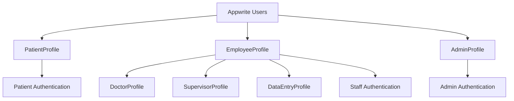

# Profile Model Architecture Design

## Executive Summary

This document presents a comprehensive Profile model architecture that extends the existing Appwrite Users collection to support multiple user types (Patient users, Healthcare worker users, Admin users) with different authentication and access patterns while maintaining backward compatibility.

## Current System Analysis

### Existing User References
- **Appwrite Users Collection**: Built-in authentication with role-based labels
- **immunization_records.administered_by_user_id**: References healthcare workers
- **patients.health_worker_id**: References assigned healthcare workers
- **Role Hierarchy**: administrator > supervisor > doctor > user
- **Facility-Based Access**: Team and label-based facility assignment

### Key Constraints
- UUID-based IDs (36 characters) for all references
- Document-level security enabled
- Facility-based data isolation
- Role-based access control via labels and teams

## Profile Architecture Overview

### Design Philosophy
1. **Extend, Don't Replace**: Profiles extend Appwrite Users, maintaining existing functionality
2. **Type-Specific Data**: Different profile types store relevant data for each user category
3. **Backward Compatibility**: Existing user references remain functional during migration
4. **Progressive Enhancement**: New features use Profiles while legacy features continue working

### Profile Types



## 1. PatientProfile Collection Schema

### Purpose
Extends Appwrite Users to support patient authentication and self-service access to immunization records.

### Collection Schema
```json
{
  "$id": "patient_profiles",
  "name": "Patient Profiles",
  "enabled": true,
  "documentSecurity": true,
  "attributes": [
    {
      "key": "user_id",
      "type": "string",
      "status": "available",
      "required": true,
      "array": false,
      "size": 36,
      "default": null
    },
    {
      "key": "patient_id",
      "type": "string",
      "status": "available",
      "required": true,
      "array": false,
      "size": 36,
      "default": null
    },
    {
      "key": "profile_status",
      "type": "string",
      "status": "available",
      "required": true,
      "array": false,
      "size": 20,
      "default": "active"
    },
    {
      "key": "verification_status",
      "type": "string",
      "status": "available",
      "required": true,
      "array": false,
      "size": 20,
      "default": "pending"
    },
    {
      "key": "verification_method",
      "type": "string",
      "status": "available",
      "required": false,
      "array": false,
      "size": 50,
      "default": null
    },
    {
      "key": "guardian_user_id",
      "type": "string",
      "status": "available",
      "required": false,
      "array": false,
      "size": 36,
      "default": null
    },
    {
      "key": "access_permissions",
      "type": "string",
      "status": "available",
      "required": true,
      "array": true,
      "size": 50,
      "default": null
    },
    {
      "key": "notification_preferences",
      "type": "string",
      "status": "available",
      "required": false,
      "array": false,
      "size": 2000,
      "default": null
    },
    {
      "key": "emergency_contact",
      "type": "string",
      "status": "available",
      "required": false,
      "array": false,
      "size": 1000,
      "default": null
    },
    {
      "key": "facility_id",
      "type": "string",
      "status": "available",
      "required": true,
      "array": false,
      "size": 36,
      "default": null
    },
    {
      "key": "created_at",
      "type": "datetime",
      "status": "available",
      "required": true,
      "array": false,
      "default": null
    },
    {
      "key": "updated_at",
      "type": "datetime",
      "status": "available",
      "required": true,
      "array": false,
      "default": null
    }
  ],
  "indexes": [
    {
      "key": "user_id_unique",
      "type": "unique",
      "status": "available",
      "attributes": ["user_id"]
    },
    {
      "key": "patient_id_unique",
      "type": "unique",
      "status": "available",
      "attributes": ["patient_id"]
    },
    {
      "key": "facility_id_index",
      "type": "key",
      "status": "available",
      "attributes": ["facility_id"]
    },
    {
      "key": "verification_status_index",
      "type": "key",
      "status": "available",
      "attributes": ["verification_status"]
    },
    {
      "key": "guardian_user_id_index",
      "type": "key",
      "status": "available",
      "attributes": ["guardian_user_id"]
    }
  ],
  "permissions": {
    "read": [
      "user:self",
      "label:role:administrator",
      "label:role:supervisor",
      "label:role:doctor",
      "team:facility-*-team/member"
    ],
    "create": [
      "label:role:administrator",
      "label:role:supervisor",
      "label:role:doctor",
      "team:facility-*-team/admin"
    ],
    "update": [
      "user:self",
      "label:role:administrator",
      "label:role:supervisor",
      "label:role:doctor",
      "team:facility-*-team/admin"
    ],
    "delete": [
      "label:role:administrator"
    ]
  }
}
```

### Field Descriptions
- **user_id**: Reference to Appwrite Users collection
- **patient_id**: Reference to existing patients collection
- **profile_status**: active, inactive, suspended
- **verification_status**: pending, verified, rejected
- **verification_method**: phone, email, in_person, guardian
- **guardian_user_id**: For minor patients, reference to guardian's user account
- **access_permissions**: Array of permissions (view_records, receive_notifications, etc.)
- **notification_preferences**: JSON string with notification settings
- **emergency_contact**: JSON string with emergency contact information

## 2. EmployeeProfile Collection Schema

### Purpose
Extends Appwrite Users for healthcare workers, supervisors, and data entry staff with professional information and facility assignments.

### Collection Schema
```json
{
  "$id": "employee_profiles",
  "name": "Employee Profiles",
  "enabled": true,
  "documentSecurity": true,
  "attributes": [
    {
      "key": "user_id",
      "type": "string",
      "status": "available",
      "required": true,
      "array": false,
      "size": 36,
      "default": null
    },
    {
      "key": "employee_id",
      "type": "string",
      "status": "available",
      "required": true,
      "array": false,
      "size": 50,
      "default": null
    },
    {
      "key": "employee_type",
      "type": "string",
      "status": "available",
      "required": true,
      "array": false,
      "size": 30,
      "default": null
    },
    {
      "key": "professional_title",
      "type": "string",
      "status": "available",
      "required": false,
      "array": false,
      "size": 100,
      "default": null
    },
    {
      "key": "license_number",
      "type": "string",
      "status": "available",
      "required": false,
      "array": false,
      "size": 100,
      "default": null
    },
    {
      "key": "license_expiry_date",
      "type": "datetime",
      "status": "available",
      "required": false,
      "array": false,
      "default": null
    },
    {
      "key": "specializations",
      "type": "string",
      "status": "available",
      "required": false,
      "array": true,
      "size": 100,
      "default": null
    },
    {
      "key": "primary_facility_id",
      "type": "string",
      "status": "available",
      "required": true,
      "array": false,
      "size": 36,
      "default": null
    },
    {
      "key": "assigned_facilities",
      "type": "string",
      "status": "available",
      "required": false,
      "array": true,
      "size": 36,
      "default": null
    },
    {
      "key": "department",
      "type": "string",
      "status": "available",
      "required": false,
      "array": false,
      "size": 100,
      "default": null
    },
    {
      "key": "supervisor_user_id",
      "type": "string",
      "status": "available",
      "required": false,
      "array": false,
      "size": 36,
      "default": null
    },
    {
      "key": "employment_status",
      "type": "string",
      "status": "available",
      "required": true,
      "array": false,
      "size": 20,
      "default": "active"
    },
    {
      "key": "hire_date",
      "type": "datetime",
      "status": "available",
      "required": false,
      "array": false,
      "default": null
    },
    {
      "key": "work_schedule",
      "type": "string",
      "status": "available",
      "required": false,
      "array": false,
      "size": 1000,
      "default": null
    },
    {
      "key": "contact_information",
      "type": "string",
      "status": "available",
      "required": false,
      "array": false,
      "size": 1000,
      "default": null
    },
    {
      "key": "emergency_contact",
      "type": "string",
      "status": "available",
      "required": false,
      "array": false,
      "size": 1000,
      "default": null
    },
    {
      "key": "training_records",
      "type": "string",
      "status": "available",
      "required": false,
      "array": false,
      "size": 2000,
      "default": null
    },
    {
      "key": "performance_metrics",
      "type": "string",
      "status": "available",
      "required": false,
      "array": false,
      "size": 2000,
      "default": null
    },
    {
      "key": "created_at",
      "type": "datetime",
      "status": "available",
      "required": true,
      "array": false,
      "default": null
    },
    {
      "key": "updated_at",
      "type": "datetime",
      "status": "available",
      "required": true,
      "array": false,
      "default": null
    }
  ],
  "indexes": [
    {
      "key": "user_id_unique",
      "type": "unique",
      "status": "available",
      "attributes": ["user_id"]
    },
    {
      "key": "employee_id_unique",
      "type": "unique",
      "status": "available",
      "attributes": ["employee_id"]
    },
    {
      "key": "primary_facility_id_index",
      "type": "key",
      "status": "available",
      "attributes": ["primary_facility_id"]
    },
    {
      "key": "employee_type_index",
      "type": "key",
      "status": "available",
      "attributes": ["employee_type"]
    },
    {
      "key": "employment_status_index",
      "type": "key",
      "status": "available",
      "attributes": ["employment_status"]
    },
    {
      "key": "supervisor_user_id_index",
      "type": "key",
      "status": "available",
      "attributes": ["supervisor_user_id"]
    },
    {
      "key": "license_expiry_date_index",
      "type": "key",
      "status": "available",
      "attributes": ["license_expiry_date"]
    }
  ],
  "permissions": {
    "read": [
      "user:self",
      "label:role:administrator",
      "label:role:supervisor",
      "team:facility-*-team/admin"
    ],
    "create": [
      "label:role:administrator",
      "label:role:supervisor",
      "team:facility-*-team/owner"
    ],
    "update": [
      "user:self",
      "label:role:administrator",
      "label:role:supervisor",
      "team:facility-*-team/owner"
    ],
    "delete": [
      "label:role:administrator"
    ]
  }
}
```

### Field Descriptions
- **employee_type**: doctor, supervisor, nurse, data_entry_clerk, technician
- **professional_title**: Dr., Nurse, Supervisor, etc.
- **license_number**: Professional license/certification number
- **specializations**: Array of medical specializations
- **assigned_facilities**: Array of facility IDs for multi-facility access
- **work_schedule**: JSON string with work schedule information
- **training_records**: JSON string with training and certification records
- **performance_metrics**: JSON string with performance data

## 3. AdminProfile Collection Schema

### Purpose
Extends Appwrite Users for system administrators with system-wide access and administrative capabilities.

### Collection Schema
```json
{
  "$id": "admin_profiles",
  "name": "Admin Profiles",
  "enabled": true,
  "documentSecurity": true,
  "attributes": [
    {
      "key": "user_id",
      "type": "string",
      "status": "available",
      "required": true,
      "array": false,
      "size": 36,
      "default": null
    },
    {
      "key": "admin_level",
      "type": "string",
      "status": "available",
      "required": true,
      "array": false,
      "size": 20,
      "default": null
    },
    {
      "key": "system_permissions",
      "type": "string",
      "status": "available",
      "required": true,
      "array": true,
      "size": 100,
      "default": null
    },
    {
      "key": "facility_access_scope",
      "type": "string",
      "status": "available",
      "required": true,
      "array": false,
      "size": 20,
      "default": "all"
    },
    {
      "key": "assigned_facilities",
      "type": "string",
      "status": "available",
      "required": false,
      "array": true,
      "size": 36,
      "default": null
    },
    {
      "key": "security_clearance",
      "type": "string",
      "status": "available",
      "required": true,
      "array": false,
      "size": 20,
      "default": null
    },
    {
      "key": "mfa_enabled",
      "type": "boolean",
      "status": "available",
      "required": true,
      "array": false,
      "default": true
    },
    {
      "key": "last_security_review",
      "type": "datetime",
      "status": "available",
      "required": false,
      "array": false,
      "default": null
    },
    {
      "key": "audit_log_access",
      "type": "boolean",
      "status": "available",
      "required": true,
      "array": false,
      "default": false
    },
    {
      "key": "system_config_access",
      "type": "boolean",
      "status": "available",
      "required": true,
      "array": false,
      "default": false
    },
    {
      "key": "user_management_scope",
      "type": "string",
      "status": "available",
      "required": true,
      "array": false,
      "size": 20,
      "default": "facility"
    },
    {
      "key": "backup_admin_user_id",
      "type": "string",
      "status": "available",
      "required": false,
      "array": false,
      "size": 36,
      "default": null
    },
    {
      "key": "admin_notes",
      "type": "string",
      "status": "available",
      "required": false,
      "array": false,
      "size": 2000,
      "default": null
    },
    {
      "key": "created_at",
      "type": "datetime",
      "status": "available",
      "required": true,
      "array": false,
      "default": null
    },
    {
      "key": "updated_at",
      "type": "datetime",
      "status": "available",
      "required": true,
      "array": false,
      "default": null
    }
  ],
  "indexes": [
    {
      "key": "user_id_unique",
      "type": "unique",
      "status": "available",
      "attributes": ["user_id"]
    },
    {
      "key": "admin_level_index",
      "type": "key",
      "status": "available",
      "attributes": ["admin_level"]
    },
    {
      "key": "security_clearance_index",
      "type": "key",
      "status": "available",
      "attributes": ["security_clearance"]
    },
    {
      "key": "facility_access_scope_index",
      "type": "key",
      "status": "available",
      "attributes": ["facility_access_scope"]
    },
    {
      "key": "last_security_review_index",
      "type": "key",
      "status": "available",
      "attributes": ["last_security_review"]
    }
  ],
  "permissions": {
    "read": [
      "user:self",
      "label:role:administrator"
    ],
    "create": [
      "label:role:administrator"
    ],
    "update": [
      "user:self",
      "label:role:administrator"
    ],
    "delete": [
      "label:role:administrator"
    ]
  }
}
```

### Field Descriptions
- **admin_level**: super_admin, system_admin, facility_admin
- **system_permissions**: Array of system-level permissions
- **facility_access_scope**: all, assigned, single
- **security_clearance**: high, medium, standard
- **user_management_scope**: global, facility, department

## Profile Integration Patterns

### 1. User Type Detection Pattern
```javascript
async function getUserProfileType(userId) {
  const checks = await Promise.allSettled([
    databases.listDocuments('main', 'patient_profiles', [Query.equal('user_id', userId)]),
    databases.listDocuments('main', 'employee_profiles', [Query.equal('user_id', userId)]),
    databases.listDocuments('main', 'admin_profiles', [Query.equal('user_id', userId)])
  ]);
  
  if (checks[0].status === 'fulfilled' && checks[0].value.documents.length > 0) {
    return { type: 'patient', profile: checks[0].value.documents[0] };
  }
  if (checks[1].status === 'fulfilled' && checks[1].value.documents.length > 0) {
    return { type: 'employee', profile: checks[1].value.documents[0] };
  }
  if (checks[2].status === 'fulfilled' && checks[2].value.documents.length > 0) {
    return { type: 'admin', profile: checks[2].value.documents[0] };
  }
  
  return { type: 'legacy', profile: null };
}
```

### 2. Backward Compatibility Pattern
```javascript
async function getUserReference(userId) {
  // First try to get profile information
  const profileInfo = await getUserProfileType(userId);
  
  if (profileInfo.type === 'employee') {
    return {
      id: userId,
      name: profileInfo.profile.professional_title + ' ' + user.name,
      type: profileInfo.profile.employee_type,
      facility_id: profileInfo.profile.primary_facility_id
    };
  }
  
  // Fallback to legacy user information
  const user = await users.get(userId);
  return {
    id: userId,
    name: user.name,
    type: 'legacy',
    facility_id: user.prefs?.facility_id
  };
}
```

### 3. Progressive Enhancement Pattern
```javascript
async function createImmunizationRecord(data) {
  // Enhanced logic for users with profiles
  const administeringUser = await getUserProfileType(data.administered_by_user_id);
  
  if (administeringUser.type === 'employee') {
    // Validate professional credentials
    if (administeringUser.profile.license_expiry_date < new Date()) {
      throw new Error('Healthcare worker license has expired');
    }
    
    // Enhanced audit trail
    data.administered_by_details = {
      employee_id: administeringUser.profile.employee_id,
      professional_title: administeringUser.profile.professional_title,
      license_number: administeringUser.profile.license_number
    };
  }
  
  // Create record with enhanced or legacy data
  return await databases.createDocument('main', 'immunization_records', ID.unique(), data);
}
```

## Authentication Patterns

### 1. Multi-Type Authentication Flow
```javascript
async function authenticateUser(email, password) {
  // Standard Appwrite authentication
  const session = await account.createEmailSession(email, password);
  const user = await account.get();
  
  // Determine user type and load appropriate profile
  const profileInfo = await getUserProfileType(user.$id);
  
  return {
    user,
    session,
    profileType: profileInfo.type,
    profile: profileInfo.profile,
    permissions: await calculateUserPermissions(user, profileInfo)
  };
}
```

### 2. Patient Self-Registration Pattern
```javascript
async function registerPatient(patientData, authData) {
  // Create Appwrite user account
  const user = await users.create(
    ID.unique(),
    authData.email,
    authData.phone,
    authData.password,
    authData.name
  );
  
  // Add patient role label
  await users.updateLabels(user.$id, ['role:patient', `facility_${patientData.facility_id}`]);
  
  // Create patient profile
  const profile = await databases.createDocument('main', 'patient_profiles', ID.unique(), {
    user_id: user.$id,
    patient_id: patientData.patient_id,
    facility_id: patientData.facility_id,
    verification_status: 'pending',
    access_permissions: ['view_own_records', 'receive_notifications']
  });
  
  return { user, profile };
}
```

### 3. Employee Onboarding Pattern
```javascript
async function onboardEmployee(employeeData, authData) {
  // Create Appwrite user account
  const user = await users.create(
    ID.unique(),
    authData.email,
    authData.phone,
    authData.password,
    authData.name
  );
  
  // Add appropriate role labels
  const roleLabel = `role:${employeeData.employee_type}`;
  const facilityLabel = `facility_${employeeData.primary_facility_id}`;
  await users.updateLabels(user.$id, [roleLabel, facilityLabel]);
  
  // Add to facility team
  const teamId = `facility-${employeeData.primary_facility_id}-team`;
  const teamRole = getTeamRoleFromEmployeeType(employeeData.employee_type);
  await teams.createMembership(teamId, user.$id, [], teamRole);
  
  // Create employee profile
  const profile = await databases.createDocument('main', 'employee_profiles', ID.unique(), {
    user_id: user.$id,
    employee_id: employeeData.employee_id,
    employee_type: employeeData.employee_type,
    primary_facility_id: employeeData.primary_facility_id,
    employment_status: 'active'
  });
  
  return { user, profile };
}
```

## Next Steps

This architecture provides:

1. **Multiple User Types**: Support for patients, employees, and admins with different authentication patterns
2. **Backward Compatibility**: Existing user references continue to work
3. **Progressive Enhancement**: New features can leverage rich profile data
4. **Security**: Appropriate permissions for each user type
5. **Scalability**: Extensible design for future user types

The next phase involves creating detailed relationship diagrams and migration strategies.