# Profile Relationship Diagrams

## Overview

This document provides comprehensive relationship diagrams showing how the new Profile collections integrate with existing Appwrite collections while maintaining backward compatibility.

## System Architecture with Profiles

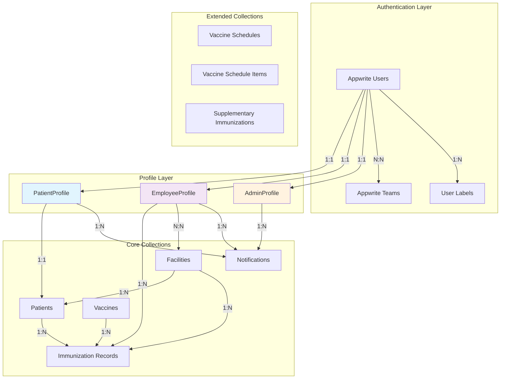

## Detailed Profile Integration Patterns

### 1. PatientProfile Integration

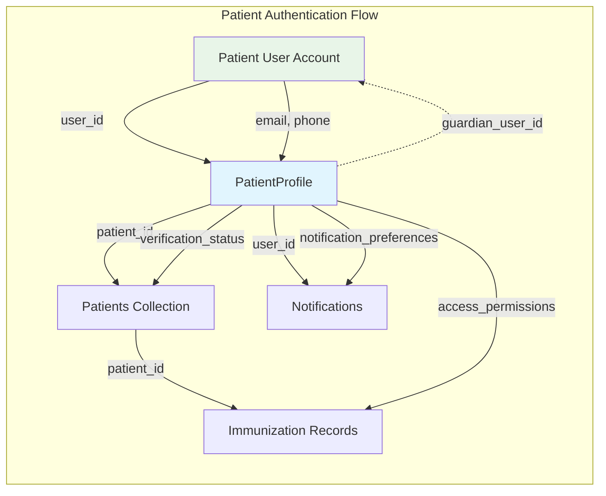

**Key Integration Points:**
- **User Account**: Standard Appwrite authentication with `role:patient` label
- **Profile Link**: `user_id` references Appwrite Users collection
- **Patient Link**: `patient_id` references existing patients collection
- **Guardian Support**: `guardian_user_id` for minor patients
- **Access Control**: `access_permissions` array controls data visibility

### 2. EmployeeProfile Integration

```mermaid
graph TB
    subgraph "Employee Authentication & Management"
        EU[Employee User Account]
        EP[EmployeeProfile]
        FT[Facility Teams]
        FA[Facilities]
        IR[Immunization Records]
        PA[Patients]
    end
    
    EU -->|user_id| EP
    EP -->|primary_facility_id| FA
    EP -->|assigned_facilities[]| FA
    EP -->|supervisor_user_id| EU
    
    EU -->|team membership| FT
    FT -->|facility access| FA
    
    %% Work Relationships
    EP -->|administered_by_user_id| IR
    PA -->|health_worker_id| EU
    
    %% Enhanced Tracking
    EP -->|employee_id| IR
    EP -->|license_number| IR
    EP -->|professional_title| IR
    
    style EP fill:#f3e5f5
    style EU fill:#e8f5e8
    style FT fill:#fff9c4
```

**Key Integration Points:**
- **Multi-Facility Access**: `assigned_facilities` array for cross-facility workers
- **Hierarchy**: `supervisor_user_id` creates management chains
- **Professional Tracking**: License numbers and expiry dates
- **Enhanced Audit**: Professional credentials in immunization records
- **Backward Compatibility**: Existing `health_worker_id` references maintained

### 3. AdminProfile Integration

```mermaid
graph TB
    subgraph "Admin Management System"
        AU[Admin User Account]
        AP[AdminProfile]
        GAT[Global Admin Team]
        FA[Facilities]
        EU[All Employee Users]
        SL[System Logs]
    end
    
    AU -->|user_id| AP
    AU -->|team membership| GAT
    
    AP -->|facility_access_scope| FA
    AP -->|assigned_facilities[]| FA
    AP -->|user_management_scope| EU
    AP -->|backup_admin_user_id| AU
    
    %% System Access
    AP -->|audit_log_access| SL
    AP -->|system_config_access| FA
    
    %% Security Features
    AP -->|mfa_enabled| AU
    AP -->|security_clearance| SL
    
    style AP fill:#fff3e0
    style AU fill:#e8f5e8
    style GAT fill:#ffebee
```

**Key Integration Points:**
- **Scope Control**: `facility_access_scope` (all/assigned/single)
- **Security Levels**: `security_clearance` and MFA requirements
- **Backup Systems**: `backup_admin_user_id` for continuity
- **Audit Access**: Enhanced logging and monitoring capabilities

## Backward Compatibility Relationships

### Current System (Maintained)

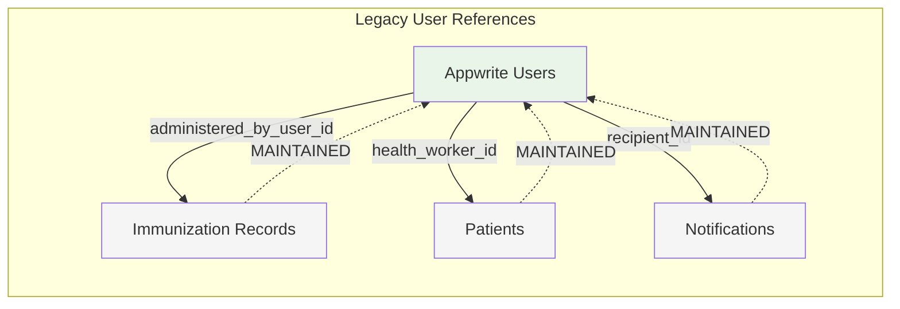

### Enhanced System (New Capabilities)

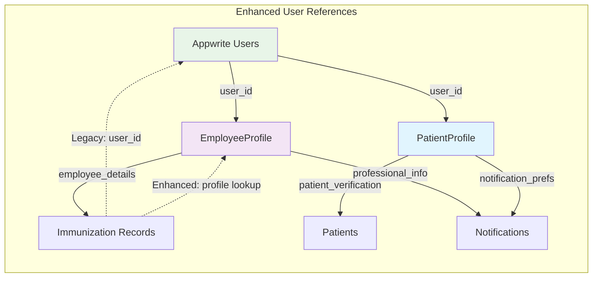

## Data Flow Patterns

### 1. User Creation Flow

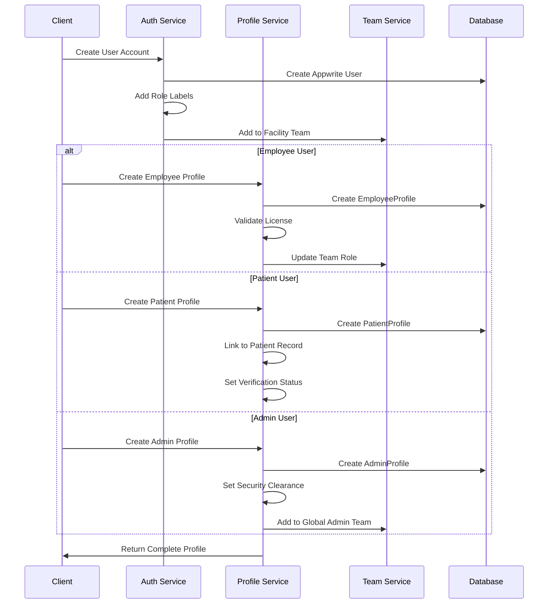

### 2. Authentication Flow

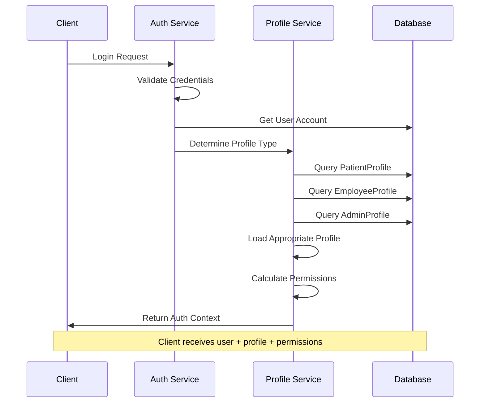

### 3. Data Access Flow

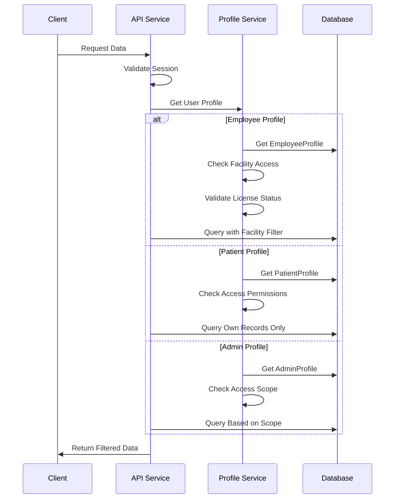

## Migration Relationship Patterns

### Phase 1: Profile Creation (Parallel System)

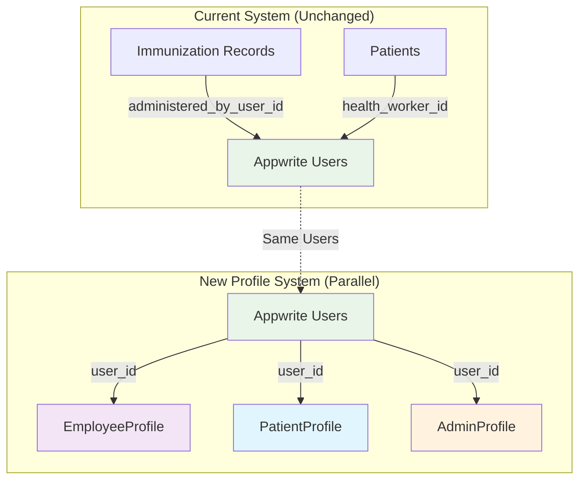

### Phase 2: Enhanced Features (Progressive Enhancement)

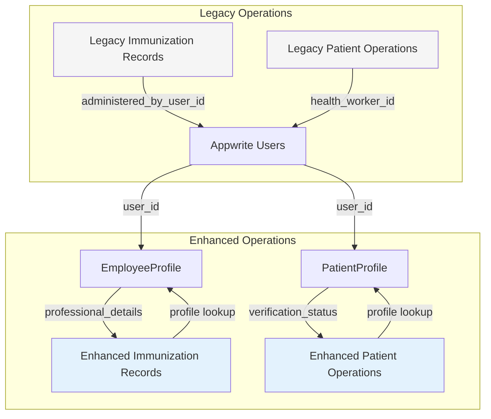

### Phase 3: Full Integration (Future State)

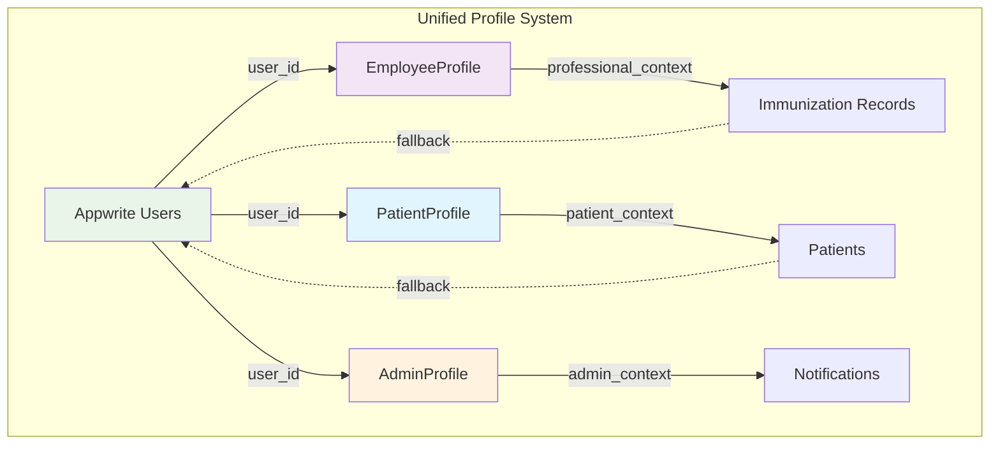

## Security Relationship Patterns

### Role-Based Access with Profiles

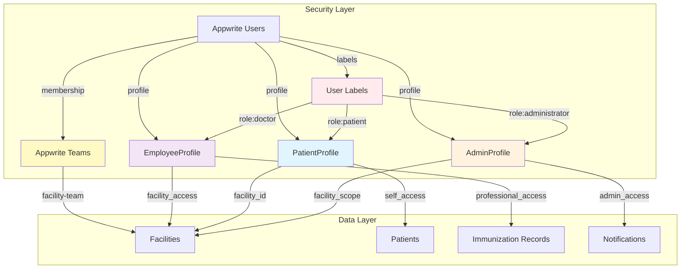

## Performance Optimization Patterns

### Profile Caching Strategy

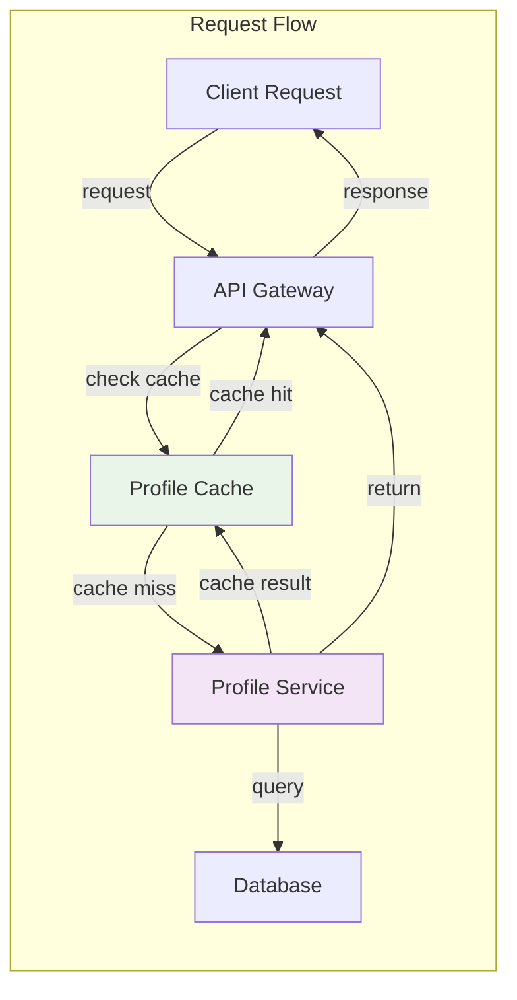

### Relationship Query Optimization

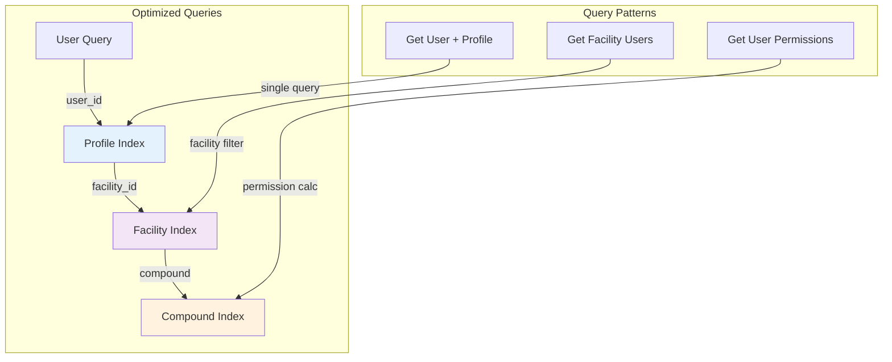

This relationship architecture ensures:

1. **Seamless Integration**: Profiles extend existing functionality without breaking changes
2. **Backward Compatibility**: All existing user references continue to work
3. **Progressive Enhancement**: New features can leverage rich profile data
4. **Security**: Appropriate access controls for each user type
5. **Performance**: Optimized queries and caching strategies
6. **Scalability**: Extensible design for future requirements

The next phase involves creating the detailed migration strategy.