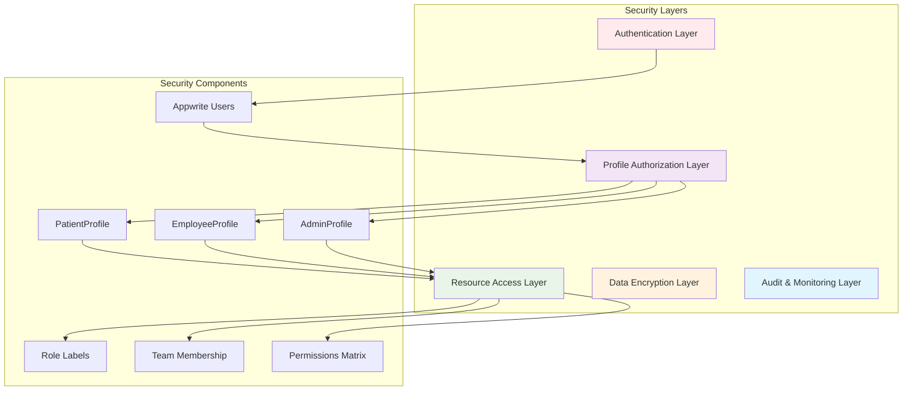

# Profile Security Considerations and Permission Updates

## Overview

This document outlines comprehensive security considerations, permission updates, and access control mechanisms for the Profile model architecture, ensuring robust security while maintaining backward compatibility with existing systems.

## Security Architecture

### Multi-Layer Security Model



## Authentication Security

### 1. Multi-Type Authentication Framework

```javascript
// Enhanced authentication with profile-based security
class ProfileAuthenticationService {
  async authenticateUser(credentials) {
    const { email, password, userType, additionalFactors } = credentials;
    
    try {
      // Standard Appwrite authentication
      const session = await account.createEmailSession(email, password);
      const user = await account.get();
      
      // Get profile information
      const profileInfo = await this.getProfileWithSecurity(user.$id);
      
      // Apply profile-specific security checks
      await this.applyProfileSecurityChecks(user, profileInfo, additionalFactors);
      
      // Generate enhanced session context
      const sessionContext = await this.createSecureSessionContext(user, profileInfo);
      
      return {
        user,
        session,
        profileType: profileInfo.type,
        profile: profileInfo.profile,
        permissions: sessionContext.permissions,
        securityLevel: sessionContext.securityLevel
      };
      
    } catch (error) {
      // Log authentication attempt
      await this.logAuthenticationAttempt(email, userType, false, error.message);
      throw error;
    }
  }
  
  async applyProfileSecurityChecks(user, profileInfo, additionalFactors) {
    switch (profileInfo.type) {
      case 'admin':
        await this.validateAdminSecurity(user, profileInfo.profile, additionalFactors);
        break;
      case 'employee':
        await this.validateEmployeeSecurity(user, profileInfo.profile);
        break;
      case 'patient':
        await this.validatePatientSecurity(user, profileInfo.profile, additionalFactors);
        break;
    }
  }
  
  async validateAdminSecurity(user, adminProfile, additionalFactors) {
    // Require MFA for admin accounts
    if (adminProfile.mfa_enabled && !additionalFactors?.mfaToken) {
      throw new Error('MFA required for admin access');
    }
    
    // Check security clearance
    if (adminProfile.security_clearance === 'high') {
      await this.validateHighSecurityAccess(user, additionalFactors);
    }
    
    // Check last security review
    const reviewDate = new Date(adminProfile.last_security_review);
    const sixMonthsAgo = new Date();
    sixMonthsAgo.setMonth(sixMonthsAgo.getMonth() - 6);
    
    if (reviewDate < sixMonthsAgo) {
      throw new Error('Security review required');
    }
  }
  
  async validateEmployeeSecurity(user, employeeProfile) {
    // Check employment status
    if (employeeProfile.employment_status !== 'active') {
      throw new Error('Employee account is not active');
    }
    
    // Check license validity for healthcare workers
    if (employeeProfile.license_expiry_date) {
      const expiryDate = new Date(employeeProfile.license_expiry_date);
      if (expiryDate < new Date()) {
        throw new Error('Professional license has expired');
      }
    }
    
    // Check facility access
    if (!employeeProfile.primary_facility_id) {
      throw new Error('No facility assignment found');
    }
  }
  
  async validatePatientSecurity(user, patientProfile, additionalFactors) {
    // Check verification status
    if (patientProfile.verification_status !== 'verified') {
      throw new Error('Patient account requires verification');
    }
    
    // Check guardian consent for minors
    if (patientProfile.guardian_user_id && !additionalFactors?.guardianConsent) {
      throw new Error('Guardian consent required');
    }
  }
}
```

### 2. Session Security Enhancement

```javascript
// Enhanced session management with profile context
class ProfileSessionManager {
  async createSecureSessionContext(user, profileInfo) {
    const basePermissions = await this.calculateBasePermissions(user);
    const profilePermissions = await this.calculateProfilePermissions(profileInfo);
    const facilityPermissions = await this.calculateFacilityPermissions(user, profileInfo);
    
    const sessionContext = {
      userId: user.$id,
      profileType: profileInfo.type,
      profileId: profileInfo.profile?.$id,
      permissions: {
        ...basePermissions,
        ...profilePermissions,
        ...facilityPermissions
      },
      securityLevel: this.determineSecurityLevel(profileInfo),
      sessionExpiry: this.calculateSessionExpiry(profileInfo),
      restrictions: await this.calculateRestrictions(profileInfo)
    };
    
    // Store session context securely
    await this.storeSessionContext(user.$id, sessionContext);
    
    return sessionContext;
  }
  
  determineSecurityLevel(profileInfo) {
    switch (profileInfo.type) {
      case 'admin':
        return profileInfo.profile.security_clearance || 'high';
      case 'employee':
        return profileInfo.profile.employee_type === 'doctor' ? 'medium' : 'standard';
      case 'patient':
        return 'standard';
      default:
        return 'basic';
    }
  }
  
  calculateSessionExpiry(profileInfo) {
    const baseExpiry = 8 * 60 * 60 * 1000; // 8 hours
    
    switch (profileInfo.type) {
      case 'admin':
        return profileInfo.profile.security_clearance === 'high' 
          ? 4 * 60 * 60 * 1000  // 4 hours for high security
          : baseExpiry;
      case 'patient':
        return 24 * 60 * 60 * 1000; // 24 hours for patients
      default:
        return baseExpiry;
    }
  }
}
```

## Authorization and Permissions

### 1. Enhanced Permission Matrix

```javascript
// Comprehensive permission matrix with profile integration
const ENHANCED_PERMISSION_MATRIX = {
  collections: {
    patients: {
      admin: {
        read: { scope: 'all', conditions: [] },
        create: { scope: 'all', conditions: [] },
        update: { scope: 'all', conditions: [] },
        delete: { scope: 'all', conditions: ['audit_required'] }
      },
      employee: {
        read: { 
          scope: 'facility', 
          conditions: ['facility_match', 'active_employment'] 
        },
        create: { 
          scope: 'facility', 
          conditions: ['facility_match', 'license_valid'] 
        },
        update: { 
          scope: 'facility', 
          conditions: ['facility_match', 'license_valid'] 
        },
        delete: { scope: 'none', conditions: [] }
      },
      patient: {
        read: { 
          scope: 'self', 
          conditions: ['verified_account', 'own_records_only'] 
        },
        create: { scope: 'none', conditions: [] },
        update: { 
          scope: 'self', 
          conditions: ['verified_account', 'limited_fields'] 
        },
        delete: { scope: 'none', conditions: [] }
      }
    },
    
    immunization_records: {
      admin: {
        read: { scope: 'all', conditions: [] },
        create: { scope: 'all', conditions: ['audit_trail'] },
        update: { scope: 'all', conditions: ['audit_trail'] },
        delete: { scope: 'all', conditions: ['audit_required', 'backup_required'] }
      },
      employee: {
        read: { 
          scope: 'facility', 
          conditions: ['facility_match', 'active_employment'] 
        },
        create: { 
          scope: 'facility', 
          conditions: ['facility_match', 'license_valid', 'professional_validation'] 
        },
        update: { 
          scope: 'own_records', 
          conditions: ['administered_by_self', 'within_edit_window'] 
        },
        delete: { scope: 'none', conditions: [] }
      },
      patient: {
        read: { 
          scope: 'self', 
          conditions: ['verified_account', 'own_records_only', 'filtered_view'] 
        },
        create: { scope: 'none', conditions: [] },
        update: { scope: 'none', conditions: [] },
        delete: { scope: 'none', conditions: [] }
      }
    },
    
    employee_profiles: {
      admin: {
        read: { scope: 'all', conditions: [] },
        create: { scope: 'all', conditions: ['hr_validation'] },
        update: { scope: 'all', conditions: ['hr_validation'] },
        delete: { scope: 'all', conditions: ['audit_required'] }
      },
      employee: {
        read: { 
          scope: 'self_and_subordinates', 
          conditions: ['hierarchy_check'] 
        },
        create: { scope: 'none', conditions: [] },
        update: { 
          scope: 'self', 
          conditions: ['limited_fields', 'supervisor_approval'] 
        },
        delete: { scope: 'none', conditions: [] }
      },
      patient: {
        read: { scope: 'none', conditions: [] },
        create: { scope: 'none', conditions: [] },
        update: { scope: 'none', conditions: [] },
        delete: { scope: 'none', conditions: [] }
      }
    },
    
    patient_profiles: {
      admin: {
        read: { scope: 'all', conditions: [] },
        create: { scope: 'all', conditions: ['patient_validation'] },
        update: { scope: 'all', conditions: ['patient_validation'] },
        delete: { scope: 'all', conditions: ['audit_required'] }
      },
      employee: {
        read: { 
          scope: 'facility', 
          conditions: ['facility_match', 'clinical_need'] 
        },
        create: { 
          scope: 'facility', 
          conditions: ['facility_match', 'patient_consent'] 
        },
        update: { 
          scope: 'facility', 
          conditions: ['facility_match', 'limited_fields'] 
        },
        delete: { scope: 'none', conditions: [] }
      },
      patient: {
        read: { scope: 'self', conditions: ['verified_account'] },
        create: { scope: 'none', conditions: [] },
        update: { 
          scope: 'self', 
          conditions: ['verified_account', 'allowed_fields'] 
        },
        delete: { scope: 'none', conditions: [] }
      }
    }
  }
};
```

### 2. Dynamic Permission Calculation

```javascript
// Dynamic permission calculator with profile context
class ProfilePermissionCalculator {
  async calculateUserPermissions(userId, resource, action) {
    const profileInfo = await this.getProfileInfo(userId);
    const permissionMatrix = ENHANCED_PERMISSION_MATRIX.collections[resource];
    
    if (!permissionMatrix || !permissionMatrix[profileInfo.type]) {
      return { allowed: false, reason: 'No permissions defined' };
    }
    
    const permissions = permissionMatrix[profileInfo.type][action];
    if (!permissions) {
      return { allowed: false, reason: 'Action not permitted' };
    }
    
    // Check scope
    const scopeCheck = await this.validateScope(userId, profileInfo, permissions.scope, resource);
    if (!scopeCheck.allowed) {
      return scopeCheck;
    }
    
    // Check conditions
    const conditionCheck = await this.validateConditions(userId, profileInfo, permissions.conditions, resource);
    if (!conditionCheck.allowed) {
      return conditionCheck;
    }
    
    return { 
      allowed: true, 
      scope: permissions.scope,
      conditions: permissions.conditions,
      profileType: profileInfo.type
    };
  }
  
  async validateScope(userId, profileInfo, scope, resource) {
    switch (scope) {
      case 'all':
        return { allowed: true };
        
      case 'facility':
        return await this.validateFacilityScope(profileInfo);
        
      case 'self':
        return { allowed: true, filters: [`user_id.equal('${userId}')`] };
        
      case 'self_and_subordinates':
        return await this.validateHierarchyScope(profileInfo);
        
      case 'own_records':
        return { allowed: true, filters: [`administered_by_user_id.equal('${userId}')`] };
        
      case 'none':
        return { allowed: false, reason: 'No access permitted' };
        
      default:
        return { allowed: false, reason: 'Unknown scope' };
    }
  }
  
  async validateConditions(userId, profileInfo, conditions, resource) {
    for (const condition of conditions) {
      const result = await this.validateCondition(userId, profileInfo, condition, resource);
      if (!result.allowed) {
        return result;
      }
    }
    return { allowed: true };
  }
  
  async validateCondition(userId, profileInfo, condition, resource) {
    switch (condition) {
      case 'facility_match':
        return await this.validateFacilityMatch(profileInfo);
        
      case 'active_employment':
        return await this.validateActiveEmployment(profileInfo);
        
      case 'license_valid':
        return await this.validateLicenseValidity(profileInfo);
        
      case 'verified_account':
        return await this.validateAccountVerification(profileInfo);
        
      case 'own_records_only':
        return { allowed: true, note: 'Filter applied automatically' };
        
      case 'audit_required':
        await this.createAuditLog(userId, resource, 'sensitive_operation');
        return { allowed: true };
        
      case 'professional_validation':
        return await this.validateProfessionalCredentials(profileInfo);
        
      default:
        return { allowed: true };
    }
  }
}
```

### 3. Field-Level Security

```javascript
// Field-level access control based on profile type
class FieldLevelSecurity {
  getFieldPermissions(profileType, collection, action) {
    const fieldPermissions = {
      patients: {
        admin: {
          read: ['*'],
          update: ['*']
        },
        employee: {
          read: ['*'],
          update: ['full_name', 'contact_phone', 'address', 'medical_history']
        },
        patient: {
          read: ['full_name', 'date_of_birth', 'contact_phone', 'address'],
          update: ['contact_phone', 'address']
        }
      },
      
      employee_profiles: {
        admin: {
          read: ['*'],
          update: ['*']
        },
        employee: {
          read: ['user_id', 'employee_id', 'professional_title', 'department', 'contact_information'],
          update: ['contact_information', 'emergency_contact']
        }
      },
      
      patient_profiles: {
        admin: {
          read: ['*'],
          update: ['*']
        },
        employee: {
          read: ['user_id', 'patient_id', 'verification_status', 'facility_id'],
          update: ['verification_status']
        },
        patient: {
          read: ['user_id', 'patient_id', 'verification_status', 'access_permissions', 'notification_preferences'],
          update: ['notification_preferences', 'emergency_contact']
        }
      }
    };
    
    return fieldPermissions[collection]?.[profileType]?.[action] || [];
  }
  
  filterFields(data, allowedFields) {
    if (allowedFields.includes('*')) {
      return data;
    }
    
    const filtered = {};
    for (const field of allowedFields) {
      if (data.hasOwnProperty(field)) {
        filtered[field] = data[field];
      }
    }
    return filtered;
  }
}
```

## Data Protection and Privacy

### 1. Data Classification and Encryption

```javascript
// Data classification and encryption service
class DataProtectionService {
  constructor() {
    this.dataClassification = {
      'public': {
        encryption: false,
        audit: false,
        retention: 'permanent'
      },
      'internal': {
        encryption: false,
        audit: true,
        retention: '7_years'
      },
      'sensitive': {
        encryption: true,
        audit: true,
        retention: 'permanent'
      },
      'restricted': {
        encryption: true,
        audit: true,
        retention: 'permanent',
        additionalControls: ['mfa_required', 'ip_restriction']
      }
    };
    
    this.fieldClassification = {
      patients: {
        'full_name': 'sensitive',
        'date_of_birth': 'sensitive',
        'contact_phone': 'sensitive',
        'address': 'sensitive',
        'medical_history': 'restricted',
        'facility_id': 'internal'
      },
      employee_profiles: {
        'license_number': 'restricted',
        'contact_information': 'sensitive',
        'emergency_contact': 'sensitive',
        'performance_metrics': 'internal'
      },
      patient_profiles: {
        'verification_method': 'internal',
        'emergency_contact': 'sensitive',
        'notification_preferences': 'internal'
      }
    };
  }
  
  async encryptSensitiveData(collection, data) {
    const encryptedData = { ...data };
    const fieldClassifications = this.fieldClassification[collection] || {};
    
    for (const [field, value] of Object.entries(data)) {
      const classification = fieldClassifications[field] || 'public';
      const protectionLevel = this.dataClassification[classification];
      
      if (protectionLevel.encryption && value) {
        encryptedData[field] = await this.encrypt(value);
      }
    }
    
    return encryptedData;
  }
  
  async decryptSensitiveData(collection, data, userProfile) {
    const decryptedData = { ...data };
    const fieldClassifications = this.fieldClassification[collection] || {};
    
    for (const [field, value] of Object.entries(data)) {
      const classification = fieldClassifications[field] || 'public';
      
      if (await this.canAccessClassification(userProfile, classification) && value) {
        decryptedData[field] = await this.decrypt(value);
      }
    }
    
    return decryptedData;
  }
  
  async canAccessClassification(userProfile, classification) {
    const protectionLevel = this.dataClassification[classification];
    
    if (protectionLevel.additionalControls?.includes('mfa_required')) {
      if (userProfile.type !== 'admin' || !userProfile.profile.mfa_enabled) {
        return false;
      }
    }
    
    return true;
  }
}
```

### 2. Privacy Controls for Patient Data

```javascript
// Patient privacy controls
class PatientPrivacyService {
  async applyPrivacyControls(patientData, accessorProfile) {
    const privacyLevel = await this.determinePrivacyLevel(patientData.patient_id);
    const accessLevel = this.determineAccessLevel(accessorProfile);
    
    return this.filterDataByPrivacyLevel(patientData, privacyLevel, accessLevel);
  }
  
  async determinePrivacyLevel(patientId) {
    // Check if patient has specific privacy preferences
    const patientProfile = await databases.listDocuments('main', 'patient_profiles', [
      Query.equal('patient_id', patientId)
    ]);
    
    if (patientProfile.documents.length > 0) {
      const preferences = JSON.parse(patientProfile.documents[0].notification_preferences || '{}');
      return preferences.privacy_level || 'standard';
    }
    
    return 'standard';
  }
  
  determineAccessLevel(accessorProfile) {
    switch (accessorProfile.type) {
      case 'admin':
        return 'full';
      case 'employee':
        return accessorProfile.profile.employee_type === 'doctor' ? 'clinical' : 'basic';
      case 'patient':
        return 'self';
      default:
        return 'none';
    }
  }
  
  filterDataByPrivacyLevel(data, privacyLevel, accessLevel) {
    const privacyRules = {
      'minimal': {
        'full': ['*'],
        'clinical': ['full_name', 'date_of_birth', 'facility_id'],
        'basic': ['full_name', 'facility_id'],
        'self': ['*']
      },
      'standard': {
        'full': ['*'],
        'clinical': ['*'],
        'basic': ['full_name', 'date_of_birth', 'contact_phone', 'facility_id'],
        'self': ['*']
      },
      'open': {
        'full': ['*'],
        'clinical': ['*'],
        'basic': ['*'],
        'self': ['*']
      }
    };
    
    const allowedFields = privacyRules[privacyLevel]?.[accessLevel] || [];
    
    if (allowedFields.includes('*')) {
      return data;
    }
    
    const filtered = {};
    for (const field of allowedFields) {
      if (data.hasOwnProperty(field)) {
        filtered[field] = data[field];
      }
    }
    
    return filtered;
  }
}
```

## Audit and Monitoring

### 1. Enhanced Audit Logging

```javascript
// Comprehensive audit logging for profile operations
class ProfileAuditService {
  async logProfileAccess(userId, profileType, resource, action, result) {
    const auditEntry = {
      timestamp: new Date().toISOString(),
      user_id: userId,
      profile_type: profileType,
      resource: resource,
      action: action,
      result: result.allowed ? 'success' : 'denied',
      reason: result.reason || null,
      ip_address: this.getClientIP(),
      user_agent: this.getUserAgent(),
      session_id: this.getSessionId(),
      additional_context: {
        scope: result.scope,
        conditions: result.conditions,
        filters_applied: result.filters
      }
    };
    
    // Store in audit collection
    await databases.createDocument('main', 'audit_logs', ID.unique(), auditEntry);
    
    // Alert on suspicious activity
    if (!result.allowed) {
      await this.checkForSuspiciousActivity(userId, auditEntry);
    }
  }
  
  async logProfileModification(userId, profileType, profileId, changes) {
    const auditEntry = {
      timestamp: new Date().toISOString(),
      user_id: userId,
      profile_type: profileType,
      profile_id: profileId,
      action: 'profile_modification',
      changes: changes,
      ip_address: this.getClientIP(),
      user_agent: this.getUserAgent()
    };
    
    await databases.createDocument('main', 'audit_logs', ID.unique(), auditEntry);
  }
  
  async checkForSuspiciousActivity(userId, auditEntry) {
    // Check for multiple failed attempts
    const recentFailures = await databases.listDocuments('main', 'audit_logs', [
      Query.equal('user_id', userId),
      Query.equal('result', 'denied'),
      Query.greaterThan('timestamp', new Date(Date.now() - 15 * 60 * 1000).toISOString())
    ]);
    
    if (recentFailures.documents.length >= 5) {
      await this.createSecurityAlert(userId, 'multiple_access_denials', {
        count: recentFailures.documents.length,
        timeframe: '15_minutes'
      });
    }
  }
  
  async createSecurityAlert(userId, alertType, details) {
    await databases.createDocument('main', 'security_alerts', ID.unique(), {
      user_id: userId,
      alert_type: alertType,
      details: JSON.stringify(details),
      severity: 'high',
      status: 'open',
      created_at: new Date().toISOString()
    });
  }
}
```

### 2. Real-time Security Monitoring

```javascript
// Real-time security monitoring for profile operations
class ProfileSecurityMonitor {
  constructor() {
    this.securityRules = {
      'unusual_access_pattern': {
        threshold: 10,
        timeframe: 60 * 60 * 1000, // 1 hour
        action: 'alert'
      },
      'privilege_escalation_attempt': {
        threshold: 1,
        timeframe: 5 * 60 * 1000, // 5 minutes
        action: 'block'
      },
      'cross_facility_access': {
        threshold: 3,
        timeframe: 30 * 60 * 1000, // 30 minutes
        action: 'review'
      }
    };
  }
  
  async monitorProfileAccess(userId, profileType, resource, action, result) {
    // Check for unusual access patterns
    await this.checkUnusualAccessPattern(userId, resource, action);
    
    // Check for privilege escalation attempts
    if (!result.allowed && result.reason?.includes('permission')) {
      await this.checkPrivilegeEscalation(userId, resource, action);
    }
    
    // Check for cross-facility access
    if (profileType === 'employee' && resource === 'patients') {
      await this.checkCrossFacilityAccess(userId, result);
    }
  }
  
  async checkUnusualAccessPattern(userId, resource, action) {
    const rule = this.securityRules['unusual_access_pattern'];
    const recentAccess = await this.getRecentAccess(userId, rule.timeframe);
    
    if (recentAccess.length > rule.threshold) {
      await this.triggerSecurityAction('unusual_access_pattern', userId, {
        access_count: recentAccess.length,
        timeframe: rule.timeframe,
        resources: [...new Set(recentAccess.map(a => a.resource))]
      });
    }
  }
  
  async triggerSecurityAction(ruleType, userId, details) {
    const rule = this.securityRules[ruleType];
    
    switch (rule.action) {
      case 'alert':
        await this.createSecurityAlert(userId, ruleType, details);
        break;
      case 'block':
        await this.blockUserTemporarily(userId, ruleType, details);
        break;
      case 'review':
        await this.flagForReview(userId, ruleType, details);
        break;
    }
  }
}
```

## Compliance and Regulatory Considerations

### 1. HIPAA Compliance

```javascript
// HIPAA compliance controls for profile data
class HIPAAComplianceService {
  constructor() {
    this.hipaaRequirements = {
      'minimum_necessary': true,
      'access_logging': true,
      'data_encryption': true,
      'user_training': true,
      'incident_response': true
    };
  }
  
  async enforceMinimumNecessary(userId, profileType, requestedData) {
    const userProfile = await this.getProfileInfo(userId);
    const necessaryFields = this.determineNecessaryFields(userProfile, requestedData);
    
    return this.filterToNecessaryFields(requestedData, necessaryFields);
  }
  
  determineNecessaryFields(userProfile, requestedData) {
    const necessaryFieldsMap = {
      'admin': {
        'patients': ['*'], // Admins may need all fields for system administration
        'immunization_records': ['*']
      },
      'employee': {
        'patients': ['full_name', 'date_of_birth', 'contact_phone', 'medical_history', 'facility_id'],
        'immunization_records': ['*'] // Healthcare workers need full records for patient care
      },
      'patient': {
        'patients': ['full_name', 'date_of_birth', 'contact_phone', 'address'], // Own data only
        'immunization_records': ['vaccine_id', 'administered_date', 'return_date', 'facility_id']
      }
    };
    
    return necessaryFieldsMap[userProfile.type] || {};
  }
  
  async logHIPAAAccess(userId, profileType, resource, accessedFields) {
    await databases.createDocument('main', 'hipaa_access_logs', ID.unique(), {
      user_id: userId,
      profile_type: profileType,
      resource: resource,
      accessed_fields: accessedFields,
      timestamp: new Date().toISOString(),
      justification: 'Patient care', // This should be provided by the application
      ip_address: this.getClientIP()
    });
  }
}
```

### 2. GDPR Compliance

```javascript
// GDPR compliance controls
class GDPRComplianceService {
  async handleDataSubjectRequest(requestType, userId, details) {
    switch (requestType) {
      case 'access':
        return await this.handleAccessRequest(userId);
      case 'rectification':
        return await this.handleRectificationRequest(userId, details);
      case 'erasure':
        return await this.handleErasureRequest(userId, details);
      case 'portability':
        return await this.handlePortabilityRequest(userId);
      default:
        throw new Error('Unknown request type');
    }
  }
  
  async handleAccessRequest(userId) {
    // Collect all personal data for the user
    const userData = await users.get(userId);
    const profileData = await this.getAllProfileData(userId);
    const relatedData = await this.getRelatedPersonalData(userId);
    
    return {
      user_account: userData,
      profiles: profileData,
      related_records: relatedData,
      generated_at: new Date().toISOString()
    };
  }
  
  async handle